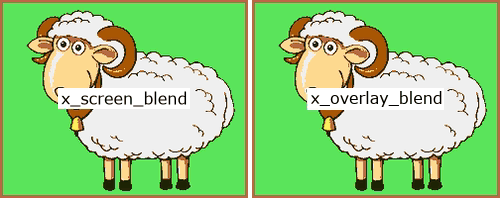

# Custom transition expressions for FFmpeg Xfade filter
### Incorporating standard easing functions and ported GL Transitions

## Summary

Xfade is a FFmpeg video transition filter which provides an expression evaluator for custom effects
but the transition rate is linear, starting and stoping abruptly and progressing at constant speed,
therefore transitions lack interest.
Easing inserts a progress envelope to smooth transitions in a natural way,
especialy useful for slideshows and presentations.


This project is a port of standard easing equations coded as custom xfade expressions.
It also ports most xfade transitions and many [GL Transitions](#gl-transitions) for use in tandem with easing or alone.

Usage involves setting the xfade `transition` parameter to `custom` and the `expr` parameter to the concatenation of an easing expression and a transition expression.
Pre-generated [expressions](expr) can be copied verbatim but a CLI [expression generator](#expression-generator-cli-script) is provided which can also produce test videos and chained visual media, e.g. slideshows.

This solution for eased transitions and GL Transitions requires no compilation or installation, just ffmpeg.
However processing is distinctly slower than alternative solutions, especially for complex effects – see [Performance](#performance).

## Example

### wipedown with cubic easing


### CLI command

```bash
ffmpeg -i first.mp4 -i second.mp4 -filter_complex_threads 1 -filter_complex "
    xfade=duration=3:offset=1:transition=custom:expr='
        st(0, if(gt(P, 0.5), 1 - 4 * (1-P)^3, 4 * P^3)) ;
        if(gt(Y, H*(1-ld(0))), A, B)
    '" output.mp4
```

Here, the `expr` parameter is shown on two lines for clarity.  
The first line is the easing expression $e(P)$ (`cubic inout`) which stores its calculated progress value in `st(0)`.  
The second line is the  transition expression $t(e(P))$ (`wipedown`) which loads its eased progress value from `ld(0)` instead of `P`.
The semicolon token combines expressions.

> [!IMPORTANT]
> ffmpeg option `-filter_complex_threads 1` is required because xfade expressions are not thread-safe (the `st()` & `ld()` functions use xfade context memory), consequently processing is slower

### Getting the expressions

In this example you can copy the easing expression from file [easings-inline.txt](expr/easings-inline.txt) and the transition expression from [transitions-rgb24-inline.txt](expr/transitions-rgb24-inline.txt).
Those contain inline expressions for CLI use.

Alternatively use the [expression generator](#expression-generator-cli-script):
```bash
xfade-easing.sh -t wipedown -e cubic -x -
```
dumps the xfade `expr` parameter:
```
'st(0,if(gt(P,0.5),1-4*(1-P)^3,4*P^3));if(gt(Y,H*(1-ld(0))),A,B)'
```

### Using a script

Some expressions are very long, so using [-filter_complex_script](https://ffmpeg.org/ffmpeg.html#filter_005fcomplex_005fscript-option) keeps things manageable and readable.

For this same example you can copy the easing expression from file [easings-script.txt](expr/easings-script.txt) and the transition expression from [transitions-rgb24-script.txt](expr/transitions-rgb24-script.txt).
Those contain multiline expressions for script use (but the inline expressions will work too).

Alternatively use [xfade-easing.sh](#expression-generator-cli-script) with expansion specifiers `expr='%n%X'` (see [Usage](#usage)):
```bash
xfade-easing.sh -t wipedown -e cubic -s "xfade=offset=10:duration=5:transition=custom:expr='%n%X'" -x script.txt
```
writes the complete xfade filter description to file script.txt:
```
xfade=offset=10:duration=5:transition=custom:expr='
st(0, if(gt(P, 0.5), 1 - 4 * (1 - P)^3, 4 * P^3))
;
if(gt(Y, H * (1 - ld(0))), A, B)'
```
and the command becomes
```bash
ffmpeg -i first.mp4 -i second.mp4 -filter_complex_threads 1 -filter_complex_script script.txt output.mp4`
```

## Expressions

Pre-generated easing and transition expressions are in the [expr/](expr) subdirectory for mix and match use.
The [expression generator](#expression-generator-cli-script) can produce combined expressions in any syntax using expansion specifiers (like `printf`).

### Inline, for -filter_complex

This format is crammed into a single line stripped of whitespace.

*Example*: `elastic out` easing (leaves progress in `st(0)`)
```
st(0,cos(20*(1-P)*PI/3)/2^(10*(1-P)))
```

### Script, for -filter_complex_script

This format is best for expressions that are too unwieldy for inline ffmpeg commands.

*Example*: `gl_rotate_scale_fade` transition (expects progress in `ld(0)` (cf. [rotate_scale_fade.glsl](https://github.com/gl-transitions/gl-transitions/blob/master/transitions/rotate_scale_fade.glsl))
```
st(1, 0.5);
st(2, 0.5);
st(3, 1);
st(4, 8);
st(5, X / W - ld(1));
st(6, (1 - Y / H) - ld(2));
st(7, hypot(ld(5), ld(6)));
st(5, ld(5) / ld(7));
st(6, ld(6) / ld(7));
st(3, 2 * PI * ld(3) * (1 - ld(0)));
st(8, 2 * abs(ld(0) - 0.5));
st(8, ld(4) * (1 - ld(8)) + 1 * ld(8));
st(4, ld(5) * cos(ld(3)) - ld(6) * sin(ld(3)));
st(6, ld(5) * sin(ld(3)) + ld(6) * cos(ld(3)));
st(1, ld(1) + ld(4) * ld(7) / ld(8));
st(2, ld(2) + ld(6) * ld(7) / ld(8));
if(between(ld(1), 0, 1) * between(ld(2), 0, 1),
 st(1, ld(1) * W);
 st(2, (1 - ld(2)) * H);
 st(3, ifnot(PLANE, a0(ld(1),ld(2)), if(eq(PLANE,1), a1(ld(1),ld(2)), if(eq(PLANE,2), a2(ld(1),ld(2)), a3(ld(1),ld(2))))));
 st(4, ifnot(PLANE, b0(ld(1),ld(2)), if(eq(PLANE,1), b1(ld(1),ld(2)), if(eq(PLANE,2), b2(ld(1),ld(2)), b3(ld(1),ld(2))))));
 st(5, 1 - ld(0));
 ld(3) * (1 - ld(5)) + ld(4) * ld(5),
 if(lt(PLANE,3), 0, 255)
)
```

### Uneased, for transitions without easing

These use `P` directly for progress instead of `ld(0)`. They are especially useful for non-Xfade transitions where custom expressions are always needed.

*Example*: `gl_WaterDrop` transition (cf. [WaterDrop.glsl](https://github.com/gl-transitions/gl-transitions/blob/master/transitions/WaterDrop.glsl))

```
st(1, 30);
st(2, 30);
st(3, 1 - P);
st(4, X / W - 0.5);
st(5, 0.5 - Y / H);
st(6, hypot(ld(4), ld(5)));
st(7, if(lte(ld(6), ld(3)),
 st(1, sin(ld(6) * ld(1) - ld(3) * ld(2)));
 st(4, ld(4) * ld(1));
 st(5, ld(5) * ld(1));
 st(4, X + ld(4) * W);
 st(5, Y - ld(5) * H);
 ifnot(PLANE, a0(ld(4),ld(5)), if(eq(PLANE,1), a1(ld(4),ld(5)), if(eq(PLANE,2), a2(ld(4),ld(5)), a3(ld(4),ld(5))))),
 A
));
ld(7) * (1 - ld(3)) + B * ld(3)
```

### Pixel format

Transitions that affect colour components work differently for RGB-type formats than non-RGB colour spaces and for different bit depths.
The expression generator [xfade-easing.sh](#expression-generator-cli-script) emulates [vf_xfade.c](https://github.com/FFmpeg/FFmpeg/blob/master/libavfilter/vf_xfade.c) function `config_output()` logic, deducing the RGB signal type (`AV_PIX_FMT_FLAG_RGB`) from the `-f` option format name (rgb/bgr/etc. see [pixdesc.c](https://github.com/FFmpeg/FFmpeg/blob/master/libavutil/pixdesc.c)) and the bit depth from `ffmpeg -pix_fmts` data.
It can then set the black, white and mid plane values correctly.
See [How does FFmpeg identify colorspaces?](https://trac.ffmpeg.org/wiki/colorspace#HowdoesFFmpegidentifycolorspaces) for details.

The expression files in [expr/](expr) cater for RGB and YUV formats with 8-bit component depth.
For faster processing of grayscale media use `xfade-easing.sh -f gray`.
Grayscale is not RGB therefore it is processed as a luma plane.

If in doubt, check with `ffmpeg -pix_fmts` or use the [xfade-easing.sh](#expression-generator-cli-script) `-f` option.

## Easing expressions

### Standard easings (Robert Penner)

This implementation uses [Michael Pohoreski’s](https://github.com/Michaelangel007/easing#tldr-shut-up-and-show-me-the-code) single argument version of [Robert Penner’s](http://robertpenner.com/easing/) easing functions, further optimised by me for the peculiarities of xfade.

- linear
- quadratic
- cubic
- quartic
- quintic
- sinusoidal
- exponential
- circular
- elastic
- back
- bounce


### Other easings

- squareroot
- cuberoot

The `squareroot` & `cuberoot` easings focus more on the middle regions and less on the extremes, opposite to `quadratic` & `cubic` respectively:


### All easings

Here are all the supported easings superimposed using the [Desmos Graphing Calculator](https://www.desmos.com/calculator):


### Overshoots

The elastic and back easings overshoot and undershoot, causing some transitions to clip and others to show colour distortion.

Rendering expressions can only access the two frames of data available.
A wrapping overshoot strategy might work for simple horizontal/vertical effects whereby fetching X & Y pixel data is intercepted.
At present, progress outside the range 0 to 1 will yield unexpected results.

## Transition expressions

### Xfade transitions

These are ports of the C-code transitions in [vf_xfade.c](https://github.com/FFmpeg/FFmpeg/blob/master/libavfilter/vf_xfade.c) for use with easing.
Omitted transitions are `distance` and `hblur` which perform aggregation, so cannot be computed efficiently on a per plane-pixel basis.

- fade fadefast fadeslow
- fadeblack fadewhite fadegrays
- wipeleft wiperight wipeup wipedown
- wipetl wipetr wipebl wipebr
- slideleft slideright slideup slidedown
- smoothleft smoothright smoothup smoothdown
- circlecrop [args: backWhite; default: =0]
- rectcrop [args: backWhite; default: =0]
- circleopen circleclose
- vertopen vertclose horzopen horzclose
- diagtl diagtr diagbl diagbr
- hlslice hrslice vuslice vdslice
- radial zoomin
- dissolve pixelize
- squeezeh squeezev
- hlwind hrwind vuwind vdwind
- coverleft coverright coverup coverdown
- revealleft revealright revealup revealdown

#### Gallery

Here are the xfade transitions processed using custom expressions instead of the built-in transitions (for testing), without easing.
See also the FFmpeg [Wiki Xfade](https://trac.ffmpeg.org/wiki/Xfade#Gallery) page.


### GL Transitions

These are xfade ports of some of the simpler GLSL transitions at [GL Transitions](https://github.com/gl-transitions/gl-transitions/tree/master/transitions) for use with or without easing.

- gl_angular [args: startingAngle,goClockwise; default: =90,0] (by: Fernando Kuteken)
- gl_BookFlip (by: hong)
- gl_CrazyParametricFun [args: a,b,amplitude,smoothness; default: =4,1,120,0.1] (by: mandubian)
- gl_crosswarp (by: Eke Péter)
- gl_DirectionalScaled [args: direction.x,direction.y,scale,backWhite; default: =0,1,0.7,0] (by: Thibaut Foussard)
- gl_directionalwarp [args: smoothness,direction.x,direction.y; default: =0.1,-1,1] (by: pschroen)
- gl_Dreamy (by: mikolalysenko)
- gl_InvertedPageCurl (by: Hewlett-Packard)
- gl_kaleidoscope [args: speed,angle,power; default: =1,1,1.5] (by: nwoeanhinnogaehr)
- gl_perlin [args: scale,smoothness; default: =4,0.01] (by: Rich Harris)
- gl_pinwheel [args: speed; default: =2] (by: Mr Speaker)
- gl_polar_function [args: segments; default: =5] (by: Fernando Kuteken)
- gl_PolkaDotsCurtain [args: dots,centre.x,centre.y; default: =20,0,0] (by: bobylito)
- gl_powerKaleido [args: scale,z,speed; default: =2,1.5,5] (by: Boundless)
- gl_randomsquares [args: size.x,size.y,smoothness; default: =10,10,0.5] (by: gre)
- gl_ripple [args: amplitude,speed; default: =100,50] (by: gre)
- gl_Rolls [args: type,RotDown; default: =0,0] (by: Mark Craig)
- gl_RotateScaleVanish [args: FadeInSecond,ReverseEffect,ReverseRotation,backWhite; default: =1,0,0,0] (by: Mark Craig)
- gl_rotateTransition (by: haiyoucuv)
- gl_rotate_scale_fade [args: centre.x,centre.y,rotations,scale,backWhite; default: =0.5,0.5,1,8,0] (by: Fernando Kuteken)
- gl_squareswire [args: squares.h,squares.v,direction.x,direction.y,smoothness; default: =10,10,1.0,-0.5,1.6] (by: gre)
- gl_static_wipe [args: transitionUpToDown,max_static_span; default: =1,0.5] (by: Ben Lucas)
- gl_Swirl (by: Sergey Kosarevsky)
- gl_WaterDrop [args: amplitude,speed; default: =30,30] (by: Paweł Płóciennik)

#### With easing

GL Transitions can also be eased, with or without parameters:

*Example*: `Swirl` transition with `bounce inout` easing


#### Gallery

<!-- GL pics at https://github.com/gre/gl-transition-libs/tree/master/packages/website/src/images/raw -->

Here are the xfade-ported GL Transitions with default parameters and no easing.
See also the [GL Transitions Gallery](https://gl-transitions.com/gallery) (which lacks many recent contributor transitions).


#### Porting

GLSL shader code runs on the GPU in real time. However GL Transition and Xfade APIs are broadly similar and simple algorithms are easily ported using vector resolution.

| context | GL Transitions | Xfade filter | notes |
| :---: | :---: | :---: | --- |
| progress | `uniform float progress` <br/> moves from 0 to 1 | `P` <br/> moves from 1 to 0 | `progress ≡ 1 - P` |
| ratio | `uniform float ratio` | `W / H` | GL width and height are normalised |
| coordinates | `vec2 uv` <br/> `uv.y == 0` is bottom <br/> `uv == vec2(1.0)` is top-right | `X`, `Y` <br/> `Y == 0` is top <br/> `(X,Y) == (W,H)` is bottom-right | `uv.x ≡ X / W` <br/> `uv.y ≡ 1 - Y / H` |
| texture | `vec4 getFromColor(vec2 uv)` <hr/> `vec4 getToColor(vec2 uv)` | `a0(x,y)` to `a3(x,y)` <br/> or `A` for first input <hr/> `b0(x,y)` to `b3(x,y)` <br/> or `B` for second input | xfade `expr` is evaluated for every texture component (plane) and pixel position <br/> <br/> `vec4 transition(vec2 uv) {...}` runs for every pixel position |

To make porting easier to follow, the expression generator Bash script [xfade-easing.sh](src/xfade-easing.sh) replicates as comments the original variable names found in the GLSL source code (and xfade C code). It also uses pseudo functions to emulate real functions, expanding them inline later.

*Example*: porting transition `gl_randomsquares`

[randomsquares.glsl](https://github.com/gl-transitions/gl-transitions/blob/master/transitions/randomsquares.glsl):
```
uniform ivec2 size; // = ivec2(10, 10)
uniform float smoothness; // = 0.5

float rand (vec2 co) {
    return fract(sin(dot(co.xy ,vec2(12.9898,78.233))) * 43758.5453);
}

vec4 transition(vec2 p) {
    float r = rand(floor(vec2(size) * p));
    float m = smoothstep(0.0, -smoothness, r - (progress * (1.0 + smoothness)));
    return mix(getFromColor(p), getToColor(p), m);
}
```
[xfade-easing.sh](src/xfade-easing.sh):
```
_make "st(1, ${a[0]-10});" # size.x
_make "st(2, ${a[1]-10});" # size.y
_make "st(3, ${a[2]-0.5});" # smoothness
_make 'st(1, floor(ld(1) * X / W));'
_make 'st(2, floor(ld(2) * (1 - Y / H)));'
_make 'st(4, frand(ld(1), ld(2), 4));' # r (frand(...) == fract(sin(dot(... algorithm)
_make 'st(4, ld(4) - ((1 - P) * (1 + ld(3))));'
_make 'st(4, smoothstep(0, -ld(3), ld(4), 4));' # m
_make 'mix(A, B, ld(4))'
```
Here, `frand()`, `smoothstep()` and `mix()` are pseudo functions.
Customizable parameters get stored first.
`_make` is just an expression string builder function.

<!--
### Other transitions

Transition `x_screen_blend` is the opposite of `gl_multiply_blend`; they lighten and darken the transition respectively.
Use `x_overlay_blend` to boost contrast by combining multiply and screen blends.

- x_screen_blend
- x_overlay_blend


-->

### Parameters

Many GL Transitions accept parameters to tweak the transition effect.
Some Xfade transitions have been altered to also accept parameters.
The parameters and default values are shown above, [here](#xfade-transitions) and [here](#gl-transitions).

Using [xfade-easing.sh](#expression-generator-cli-script), parameters can be appended to the transition name as CSV.

*Example*: two pinwheel speeds: `-t gl_pinwheel=0.5` and `-t gl_pinwheel=10`


Alternatively just hack the [expressions](expr) directly.
The parameters are specified first, using store functions `st(p,v)`
where `p` is the parameter number and `v` its value.
So for `gl_pinwheel` with a `speed` value 10, change the first line of its expr below to `st(1, 10);`.
```
st(1, 2);
st(2, 1 - ld(0));
st(1, atan2(0.5 - Y / H, X / W - 0.5) + ld(2) * ld(1));
st(1, mod(ld(1), PI / 4));
st(1, sgn(ld(2) - ld(1)));
st(1, gte(0.5, ld(1)));
B * (1 - ld(1)) + A * ld(1)
```
Similarly, `gl_directionalwarp` takes 3 parameters: `smoothness`, `direction.x`, `direction.y` (from `xfade-easing.sh -L`)
and its expr starts with 3 corresponding `st()` (store) functions which may be changed from their default values:
```
st(1, 0.1);
st(2, -1);
st(3, 1);
st(4, hypot(ld(2), ld(3)));
etc.
```
Note though that certain parameters are implemented as bash constructs within [xfade-easing.sh](src/xfade-easing.sh), e.g. `backWhite`.

### Performance

Custom transitions apply an interpreted equation to each pixel in each plane which obviously incurs a performance hit, further exacerbated by disabling multithreading in order to use the `st()` and `ld()` functions.
So these custom expressions are not fast – but they are convenient because they use plain vanilla ffmpeg commands.

The following times are based on empirical timings scaled by benchmark scores (the [Geekbench Mac Benchmark Chart](https://browser.geekbench.com/mac-benchmarks)).
They are rough estimates in seconds to process a 3-second transition of HD720 (1280x720) 3-plane media, raw-encoded to a null device (`-an -f rawvideo -y /dev/null`) at benchmark midpoints.
For greyscale (single plane), subtract two thirds.
For an alpha plane, add a third.
Mac model performance varies enormously so the Mac dates are very approximate.
Windows performance has not been measured.

| benchmark → <br/> transition ↓ | 2333–3129 <br/> (M1,M2,M3 Macs) | 1150–1655 <br/> (2017–19 Macs) | 700–1150 <br/> (2013–16 Macs) | 195–700 <br/> (2008–12 Macs) |
| :---: | :---: | :---: | :---: | :---: |
| wipeleft | 2 | 3 | 5 | 10 |
| wipeup | 2 | 3 | 5 | 10 |
| fade | 2 | 4 | 6 | 12 |
| wipedown | 3 | 5 | 8 | 16 |
| wiperight | 3 | 5 | 8 | 16 |
| wipetl | 4 | 7 | 10 | 21 |
| wipebl | 4 | 9 | 13 | 27 |
| wipetr | 5 | 9 | 13 | 28 |
| wipebr | 5 | 9 | 14 | 30 |
| squeezeh | 8 | 15 | 23 | 47 |
| squeezev | 9 | 17 | 25 | 52 |
| fadeslow | 13 | 26 | 39 | 80 |
| dissolve | 14 | 26 | 40 | 82 |
| revealleft | 14 | 28 | 43 | 88 |
| coverleft | 15 | 29 | 44 | 90 |
| fadefast | 15 | 29 | 45 | 92 |
| revealup | 15 | 29 | 45 | 92 |
| revealdown | 16 | 30 | 46 | 94 |
| coverright | 16 | 30 | 46 | 96 |
| revealright | 16 | 30 | 46 | 96 |
| slideleft | 16 | 31 | 47 | 96 |
| coverup | 16 | 31 | 47 | 98 |
| slideup | 16 | 31 | 47 | 98 |
| smoothup | 16 | 31 | 47 | 98 |
| horzclose | 16 | 32 | 48 | 100 |
| vertclose | 17 | 32 | 49 | 100 |
| coverdown | 17 | 33 | 49 | 100 |
| slidedown | 17 | 33 | 50 | 105 |
| horzopen | 17 | 34 | 52 | 105 |
| slideright | 17 | 34 | 52 | 105 |
| smoothleft | 18 | 34 | 52 | 105 |
| rectcrop | 18 | 35 | 54 | 110 |
| vertopen | 18 | 35 | 54 | 110 |
| diagtl | 18 | 36 | 54 | 110 |
| smoothdown | 19 | 38 | 58 | 120 |
| smoothright | 20 | 38 | 58 | 120 |
| circlecrop | 20 | 39 | 58 | 120 |
| diagbl | 20 | 40 | 60 | 125 |
| diagtr | 21 | 41 | 62 | 130 |
| radial | 22 | 42 | 64 | 130 |
| diagbr | 22 | 43 | 66 | 135 |
| gl_polar_function | 27 | 52 | 80 | 165 |
| gl_pinwheel | 28 | 54 | 82 | 170 |
| circleclose | 30 | 58 | 88 | 180 |
| circleopen | 30 | 58 | 88 | 185 |
| hlslice | 32 | 62 | 94 | 195 |
| vuslice | 32 | 62 | 94 | 195 |
| hlwind | 34 | 66 | 100 | 205 |
| vdwind | 34 | 66 | 100 | 205 |
| vuwind | 34 | 66 | 100 | 205 |
| gl_PolkaDotsCurtain | 34 | 66 | 100 | 210 |
| gl_WaterDrop | 34 | 66 | 100 | 210 |
| hrwind | 34 | 66 | 100 | 210 |
| vdslice | 35 | 68 | 105 | 210 |
| gl_angular | 35 | 68 | 105 | 215 |
| hrslice | 36 | 70 | 105 | 220 |
| fadewhite | 37 | 72 | 110 | 225 |
| fadeblack | 39 | 76 | 115 | 235 |
| pixelize | 41 | 80 | 120 | 250 |
| gl_randomsquares | 43 | 84 | 125 | 260 |
| zoomin | 43 | 84 | 130 | 265 |
| gl_Dreamy | 48 | 94 | 140 | 295 |
| gl_rotateTransition | 49 | 96 | 145 | 300 |
| fadegrays | 50 | 98 | 150 | 310 |
| gl_BookFlip | 54 | 105 | 160 | 330 |
| gl_crosswarp | 54 | 105 | 160 | 330 |
| gl_ripple | 56 | 110 | 165 | 340 |
| gl_Rolls | 56 | 110 | 165 | 345 |
| gl_RotateScaleVanish | 64 | 125 | 190 | 395 |
| gl_Swirl | 68 | 130 | 200 | 410 |
| gl_InvertedPageCurl | 80 | 155 | 235 | 490 |
| gl_DirectionalScaled | 86 | 165 | 250 | 520 |
| gl_CrazyParametricFun | 86 | 165 | 255 | 525 |
| gl_rotate_scale_fade | 88 | 170 | 260 | 535 |
| gl_squareswire | 90 | 175 | 265 | 545 |
| gl_directionalwarp | 94 | 185 | 280 | 575 |
| gl_static_wipe | 96 | 190 | 285 | 590 |
| gl_perlin | 135 | 270 | 405 | 840 |
| gl_kaleidoscope | 250 | 490 | 740 | 1530 |
| gl_powerKaleido | 1020 | 1990 | 3020 | 6240 |

The slowest transition gl_powerKaleido is clearly impractical for most purposes!

The most complex transition is gl_InvertedPageCurl which involved much refactoring to port it to ffmpeg.
The [refactored InvertedPageCurl.glsl](src/InvertedPageCurl-refactored.glsl) omits anti-aliasing for simplicity.

There are better and faster ways to use GL Transitions with FFmpeg:
- [ffmpeg-gl-transition](https://github.com/transitive-bullshit/ffmpeg-gl-transition) is a native FFmpeg filter which requires building ffmpeg from source
- [ffmpeg-concat](https://github.com/transitive-bullshit/ffmpeg-concat) is a Node.js package which requires installation and a lot of temporary storage
- [gl-transition-render](https://www.npmjs.com/package/gl-transition-scripts) is a Node.js script to render GL Transitions with images on the CLI
- the FFmpeg [xfade_opencl](https://ffmpeg.org/ffmpeg-filters.html#xfade_005fopencl) filter can do custom transitions from OpenCL source but enablement is quite involved and OpenCL is not not OpenGL

## Expression generator CLI script

[xfade-easing.sh](src/xfade-easing.sh) is a Bash 4 script that generates custom easing and transition expressions for the xfade `expr` parameter.
It can also generate easing graphs via gnuplot and demo videos for testing.

### Usage
```
FFmpeg Xfade Easing script (xfade-easing.sh version 1.7) by Raymond Luckhurst, scriptit.uk
Generates custom xfade expressions for rendering transitions with easing
See https://github.com/scriptituk/xfade-easing
Usage: xfade-easing.sh [options] [video inputs]
Options:
    -f pixel format (default: rgb24): use ffmpeg -pix_fmts for list
    -t transition name (default: fade); use -L for list
    -e easing function (default: linear); see -L for list
    -m easing mode (default: inout): in out inout
    -x expr output filename (default: no expr), accepts expansions, - for stdout
    -a append to expr output file
    -s expr output format string (default: '%x')
       %t expands to the transition name; %e easing name; %m easing mode
       %T, %E, %M upper case expansions of above
       %a expands to the transition arguments; %A to the default arguments (if any)
       %x expands to the generated expr, condensed, intended for inline filterchains
       %X does too but is not condensed, intended for -filter_complex_script files
       %y expands to the easing expression only, inline; %Y script
       %z expands to the eased transition expression only, inline; %Z script
          for the uneased transition expression only, omit -e option and use %x or %X
       %n inserts a newline
    -p easing plot output filename (default: no plot)
       accepts expansions but %m/%M are pointless as plots show all easing modes
       formats: gif, jpg, png, svg, pdf, eps, html <canvas>, determined from file extension
    -c canvas size for easing plot (default: 640x480, scaled to inches for PDF/EPS)
       format: WxH; omitting W or H keeps aspect ratio, e.g -z x300 scales W
    -v video output filename (default: no video), accepts expansions
       formats: animated gif, mp4 (x264 yuv420p), mkv (FFV1 lossless) from file extension
       if gifsicle is available then gifs will be optimised
    -z video size (default: input 1 size)
       format: WxH; omitting W or H keeps aspect ratio, e.g -z 300x scales H
    -l video length (default: 5s per transition)
    -d video transition duration (default: 3s)
    -r video framerate (default: 25fps)
    -n show effect name on video as text (requires the libfreetype library)
    -u video text font size multiplier (default: 1.0)
    -2 video stack orientation,gap,colour,padding (default: ,0,white,0), e.g. h,2,red,1
       stacks uneased and eased videos horizontally (h), vertically (v) or auto (a)
       auto (a) selects the orientation that displays easing to best effect
       also stacks transitions with default and custom parameters, eased or not
       videos are not stacked unless they are different (nonlinear or customised)
       unstacked videos can be padded using orientation=1, e.g. 1,0,blue,5
    -L list all transitions and easings
    -H show this usage text
    -V show this script version
    -I set ffmpeg loglevel info for -v (default: warning)
    -P log xfade progress percentage using print() (implies -I)
    -T temporary file directory (default: /tmp)
    -K keep temporary files if temporary directory is not /tmp
Notes:
    1. point the shebang path to a bash4 location (defaults to MacPorts install)
    2. this script requires Bash 4 (2009), gawk, gsed, envsubst, ffmpeg, gnuplot, base64
    3. use -filter_complex_threads 1 ffmpeg option (slower!) because xfade expressions
       are not thread-safe (the st() & ld() functions use contextual allocation)
    4. certain xfade transitions are not implemented because they perform aggregation
       (distance, hblur)
    5. many GL Transitions are also ported, some of which take parameters;
       to override defaults append parameters as CSV after an = sign,
       e.g. -t gl_PolkaDotsCurtain=10,0.5,0.5 for 10 dots centred
    6. many transitions do not lend themselves well to easing, and easings that overshoot
       (back & elastic) may cause weird effects!
```
### Generating expr code

Expr code is generated using the `-x` option and customised with the `-s`,`-a` options.

- `xfade-easing.sh -t slideright -e quadratic -m out -x -`  
prints expr for slideright transition with quadratic-out easing to stdout
- `xfade-easing.sh -t coverup -e quartic -m in -x coverup-quartic_in.txt`  
prints expr for coverup transition with quartic-in easing to file coverup-quartic_in.txt
- `xfade-easing.sh -t coverup -e quartic -m in -x %t-%e_%m.txt`  
ditto, using expansion specifiers in file name
- `xfade-easing.sh -t rectcrop -e exponential -m out -s "\$expr['%t_%e_%m'] = '%n%X';" -x exprs.php -a`  
appends the following to file exprs.php:
```php
$expr['rectcrop_exponential_out'] = '
st(0, if(eq(P, 0), 0, 2^(-10 * (1 - P))))
;
st(1, abs(ld(0) - 0.5) * W);
st(2, abs(ld(0) - 0.5) * H);
st(3, lt(abs(X - W / 2), ld(1) * lt(abs(Y - H / 2), ld(2))));
st(4, if(lt(ld(0), 0.5), B, A));
ifnot(ld(3), if(lt(PLANE,3), 0, 255), ld(4))';
```
- `xfade-easing.sh -t gl_polar_function -s "expr='%n%X'" -x fc-script.txt -a`  
This is not eased, therefore the expr appended to fc-script.txt uses progress `P` directly:
```shell
expr='
st(1, 5);
st(2, X / W - 0.5);
st(3, 0.5 - Y / H);
st(4, atan2(ld(3), ld(2)) - PI / 2);
st(4, cos(ld(1) * ld(4)) / 4 + 1);
st(1, hypot(ld(2), ld(3)));
if(gt(ld(1), ld(4) * (1 - P)), A, B)'
```

### Generating test plots

Plots are generated using the `-p` option and customised with the `-c` option.

Plot data is logged using the `print` function of the ffmpeg expression evaluator for the first plane and first pixel as xfade progress `P` goes from 1 to 0 at 100fps.
It is therefore actual expression data.

- `xfade-easing.sh -e elastic -p plot-%e.pdf`  
creates a PDF file plot-elastic.pdf of the elastic easing
- `xfade-easing.sh -e bounce -p %e.png -c 500x`  
creates image file bounce.png of the bounce easing scaled to 500px wide:


The plots above in [Standard easings](#standard-easings-robert-penner) show the test plots for all standard easings and all three modes (in, out and in-out).

### Generating demo videos

Videos are generated using the `-v` option and customised with the `-z` ,`-l`,`-d`,`-r`,`-n`,`-u`,`-2` options.

> [!NOTE]
> all demos on this page show animated GIFs of transition effects on still images except for the top two which have video inputs

- `xfade-easing.sh -t hlwind -e quintic -m in -v windy.gif`  
creates an animated GIF image of the hlwind transition with quintic-in easing using default built-in images  


- `xfade-easing.sh -t fadeblack -e circular -v maths.mp4 -z 250x dot.png cross.png`  
creates a MP4 video of the fadeblack transition with circular easing using specified inputs  


- `xfade-easing.sh -t coverdown -e bounce -m out -v %t-%e-%m.mp4 wallace.png shaun.png`  
creates a video of the coverdown transition with bounce-out easing using expansion specifiers for the output file name  


- `xfade-easing.sh -t gl_polar_function=25 -v paradise.mkv -n -u 1.2 islands.png rainbow.png`  
creates a lossless (FFV1) video (e.g. for further processing) of an uneased polar_function GL transition with 25 segments annotated in enlarged text  


- `xfade-easing.sh -t gl_angular=270,1 -e exponential -v multiple.mp4 -n -2 h -l 20 street.png road.png flowers.png bird.png barley.png`  
creates a video of the angular GL transition with parameter `startingAngle=270` (south) and `clockwise=1` (an added parameter) for 5 inputs with fast exponential easing  


- `xfade-easing.sh -t gl_BookFlip -e quartic -m out -v book.gif -f gray -z 248x -n -2 h,2,black,1 alice-12.png alice-34.png`  
creates a simple greyscale page turn with quartic-out easing for a more realistic effect.  


- `xfade-easing.sh -t circlecrop=1 -e sinusoidal -v home-away.mp4 -l 10 -d 8 -z 246x -2 h,4,LightSkyBlue,2 -n phone.png beach.png`  
creates a 10s video with a slow 8s circlecrop Xfade transition with white background (added parameter) and sinusoidal easing, horizontally stacked with a 4px `LightSkyBlue` gap (see [Color](https://ffmpeg.org/ffmpeg-utils.html#Color)) and 2px padding  


- `xfade-easing.sh -t gl_InvertedPageCurl -e cubic -m in -v score.mp4 -f gray -l 12 -d 3 -z 480x -2 1,0,0xD8D8D8,10 fugue1.png fugue2.png fugue3.png`  
a page curl effect with cubic-in easing using grayscale format (the `-2 1,0,colour,padding` trick creates a border)  
  
(I play [this Bach fugue](https://youtu.be/5IGKLtCrUt0?t=1m17s) on my YouTube channel [digitallegro](https://www.youtube.com/@digitallegro/videos) but the page curl there was generated by [ffmpeg-concat](https://github.com/transitive-bullshit/ffmpeg-concat))

- `xfade-easing.sh -t gl_PolkaDotsCurtain=10,0.5,0.5 -e quadratic -v living-life.mp4 -l 7 -d 5 -z 500x -r 30 -f yuv420p balloons.png fruits.png`  
a GL transition with arguments and gentle quadratic easing, running at 30fps for 7 seconds, processing in YUV (Y'CbCr) colour space throughout  


## See also

- [FFmpeg Xfade filter](https://ffmpeg.org/ffmpeg-filters.html#xfade) reference documentation
- [FFmpeg Wiki Xfade page](https://trac.ffmpeg.org/wiki/Xfade) with gallery
- [FFmpeg Expression Evaluation](https://ffmpeg.org/ffmpeg-utils.html#Expression-Evaluation) reference documentation
- [Robert Penner’s Easing Functions](http://robertpenner.com/easing/) the original, from 2001
- [Michael Pohoreski’s Easing Functions](https://github.com/Michaelangel007/easing#tldr-shut-up-and-show-me-the-code) single oarameter versions of Penner’s Functions
- [GL Transitions homepage](https://gl-transitions.com) and [Gallery](https://gl-transitions.com/gallery) and [Editor](https://gl-transitions.com/editor)
- [GL Transitions repository](https://github.com/gl-transitions/gl-transitions) on GitHub
- [GLSL Data Types](https://www.khronos.org/opengl/wiki/Data_Type_(GLSL)) and [OpenGL Reference Pages](https://registry.khronos.org/OpenGL-Refpages/gl4/)
- [GLSL Vector and Matrix Operations](https://en.wikibooks.org/wiki/GLSL_Programming/Vector_and_Matrix_Operations) GLSL specific built-in data types and functions
- [libavfilter/vf_xfade.c](https://github.com/FFmpeg/FFmpeg/blob/master/libavfilter/vf_xfade.c) xfade source code
- [libavutil/eval.c](https://github.com/FFmpeg/FFmpeg/blob/master/libavutil/eval.c) expr source code
- [ffmpeg-gl-transition](https://github.com/transitive-bullshit/ffmpeg-gl-transition) native FFmpeg GL Transitions filter
- [ffmpeg-concat](https://github.com/transitive-bullshit/ffmpeg-concat) Node.js package, concats videos with GL Transitions
- [gl-transition-render](https://www.npmjs.com/package/gl-transition-scripts) Node.js script to render GL Transitions with images on the CLI
