# FFmpeg Xfade custom easing and transition expressions

## Summary

Xfade is a FFmpeg video transition filter which provides an expression evaluator for custom effects.
Xfade transition progress is linear, so it starts and stops abruptly and appears disjointed.
Easing inserts a transition progress envelope to smooth the effect.

This is a port of standard easing equations coded as custom xfade expressions.
It also ports most xfade transitions, some [GL Transitions](https://github.com/gl-transitions/gl-transitions) and other transitions for use in tandem with easing or alone.

Deployment involves setting the xfade `transition` parameter to `custom` and the `expr` parameter to the concatenation of an easing expression and a transition expression.
Pre-generated [expressions](expr) can be copied verbatim but a CLI [expression generator](#expression-generator-cli-script) is also provided.

## Example

### wipedown with cubic easing

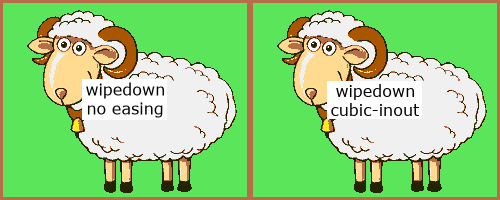

### CLI command

```bash
ffmpeg -i first.mp4 -i second.mp4 -filter_complex_threads 1 -filter_complex "
    xfade=duration=3:offset=1:transition=custom:expr='
        st(0, if(gt(P, 0.5), 1 - 4 * (1-P)^3, 4 * P^3)) ;
        if(gt(Y, H*(1-ld(0))), A, B)
    '" output.mp4
```

Here, the `expr` parameter is shown on two lines for clarity.  
The first line is the easing expression $e(P)$ (`cubic inout`) which stores its calculated progress value in `st(0)`.  
The second line is the  transition expression $t(e(P))$ (`wipedown`) which loads its eased progress value from `ld(0)` instead of `P`.
The semicolon token combines expressions.

> [!IMPORTANT]
> ffmpeg option `-filter_complex_threads 1` is required because xfade expressions are not thread-safe (the `st()` & `ld()` functions use xfade context memory), consequently processing is slower

### Getting the expressions

In this example you can copy the easing expression from file [easings-inline.txt](expr/easings-inline.txt) and the transition expression from [transitions-rgb24-inline.txt](expr/transitions-rgb24-inline.txt).
Those contain inline expressions for CLI use.

Alternatively use the [expression generator](#expression-generator-cli-script):
```bash
xfade-easing.sh -t wipedown -e cubic -x -
```
dumps the xfade `expr` parameter:  
```
'st(0,if(gt(P,0.5),1-4*(1-P)^3,4*P^3));if(gt(Y,H*(1-ld(0))),A,B)'
```

### Using a script

Some expressions are very long, so using [-filter_complex_script](https://ffmpeg.org/ffmpeg.html#filter_005fcomplex_005fscript-option) keeps things manageable and readable.

For this same example you can copy the easing expression from file [easings-script.txt](expr/easings-script.txt) and the transition expression from [transitions-rgb24-script.txt](expr/transitions-rgb24-script.txt).
Those contain multiline expressions for script use (but the inline expressions will work too).

Alternatively use [xfade-easing.sh](#expression-generator-cli-script) with expansion specifiers `expr='%n%X'` (see [Usage](#usage)):
```bash
xfade-easing.sh -t wipedown -e cubic -s "xfade=offset=10:duration=5:transition=custom:expr='%n%X'" -x script.txt
```
writes the complete xfade filter description to file script.txt:
```
xfade=offset=10:duration=5:transition=custom:expr='
st(0, if(gt(P, 0.5), 1 - 4 * (1 - P)^3, 4 * P^3))
;
if(gt(Y, H * (1 - ld(0))), A, B)'
```
and the command becomes
```bash
ffmpeg -i first.mp4 -i second.mp4 -filter_complex_threads 1 -filter_complex_script script.txt output.mp4`
```

## Expressions

Pre-generated easing and transition expressions are in the [expr/](expr) subdirectory for mix and match use.
The [expression generator](#expression-generator-cli-script) can produce combined expressions in any syntax using expansion specifiers (like `printf`).

### Inline, for -filter_complex

This format is crammed into a single line stripped of whitespace.

*Example*: `elastic out` easing (leaves progress in `st(0)`)
```
st(0,cos(20*(1-P)*PI/3)/2^(10*(1-P)))
```

### Script, for -filter_complex_script

This format is best for expressions that are too unwieldy for inline ffmpeg commands.

*Example*: `gl_rotate_scale_fade` transition (expects progress in `ld(0)` (cf. [rotate_scale_fade.glsl](https://github.com/gl-transitions/gl-transitions/blob/master/transitions/rotate_scale_fade.glsl))
```
st(1, 0.5);
st(2, 0.5);
st(3, 1);
st(4, 8);
st(5, 1 - ld(0));
st(6, X / W - ld(1));
st(7, (1 - Y / H) - ld(2));
st(8, hypot(ld(6), ld(7)));
st(6, ld(6) / ld(8));
st(7, ld(7) / ld(8));
st(3, 2 * PI * ld(3) * ld(5));
st(9, 2 * abs(ld(0) - 0.5));
st(4, ld(4) * (1 - ld(9)) + 1 * ld(9));
st(6, st(9, ld(6)) * cos(ld(3)) - ld(7) * sin(ld(3)));
st(7, ld(9) * sin(ld(3)) + ld(7) * cos(ld(3)));
st(1, ld(1) + ld(6) * ld(8) / ld(4));
st(2, ld(2) + ld(7) * ld(8) / ld(4));
if(between(ld(1), 0, 1) * between(ld(2), 0, 1),
 st(1, ld(1) * W);
 st(2, (1 - ld(2)) * H);
 st(1, if(eq(PLANE,0), a0(ld(1),ld(2)), if(eq(PLANE,1), a1(ld(1),ld(2)), if(eq(PLANE,2), a2(ld(1),ld(2)), a3(ld(1),ld(2))))));
 st(2, if(eq(PLANE,0), b0(ld(1),ld(2)), if(eq(PLANE,1), b1(ld(1),ld(2)), if(eq(PLANE,2), b2(ld(1),ld(2)), b3(ld(1),ld(2))))));
 ld(1) * (1 - ld(5)) + ld(2) * ld(5),
 if(lt(PLANE,3), 0, 255)
)
```

### Uneased, for transitions without easing

These use `P` directly for progress instead of `ld(0)`. They are especially useful for non-Xfade transitions where custom expressions are always needed.

*Example*: `gl_WaterDrop transition` – cf. [WaterDrop.glsl](https://github.com/gl-transitions/gl-transitions/blob/master/transitions/WaterDrop.glsl)

```
st(1, 30);
st(2, 30);
st(3, X / W - 0.5);
st(4, 0.5 - Y / H);
st(5, hypot(ld(3), ld(4)));
st(6, if(lte(ld(5), 1 - P),
 st(1, sin(ld(5) * ld(1) - (1 - P) * ld(2)));
 st(3, ld(3) * ld(1));
 st(4, ld(4) * ld(1));
 st(3, X + ld(3) * W);
 st(4, Y - ld(4) * H);
 if(eq(PLANE,0), a0(ld(3),ld(4)), if(eq(PLANE,1), a1(ld(3),ld(4)), if(eq(PLANE,2), a2(ld(3),ld(4)), a3(ld(3),ld(4))))),
 A
));
B * (1 - P) + ld(6) * P
```

### Pixel format

Transitions that affect colour components work differently for RGB-type formats than non-RGB colour spaces and for different bit depths.
The expression generator [xfade-easing.sh](#expression-generator-cli-script) emulates [vf_xfade.c](https://github.com/FFmpeg/FFmpeg/blob/master/libavfilter/vf_xfade.c) function `config_output()` logic, deducing the RGB signal type (`AV_PIX_FMT_FLAG_RGB`) from the `-f` option format name (rgb/bgr/etc. see [pixdesc.c](https://github.com/FFmpeg/FFmpeg/blob/master/libavutil/pixdesc.c)) and the bit depth from `ffmpeg -pix_fmts` data.
It can then set the black, white and mid plane values correctly.
See [How does FFmpeg identify colorspaces?](https://trac.ffmpeg.org/wiki/colorspace#HowdoesFFmpegidentifycolorspaces) for details.

The expression files in [expr/](expr) cater for RGB and YUV formats with 8-bit component depth.
If in doubt, check with `ffmpeg -pix_fmts` or use the [xfade-easing.sh](#expression-generator-cli-script) `-f` option.

## Easing expressions

### Standard easings (Robert Penner)

This implementation uses [Michael Pohoreski’s](https://github.com/Michaelangel007/easing#tldr-shut-up-and-show-me-the-code) single argument version of [Robert Penner’s](http://robertpenner.com/easing/) easing functions, further optimised by me for the peculiarities of xfade.

- linear
- quadratic
- cubic
- quartic
- quintic
- sinusoidal
- exponential
- circular
- elastic
- back
- bounce

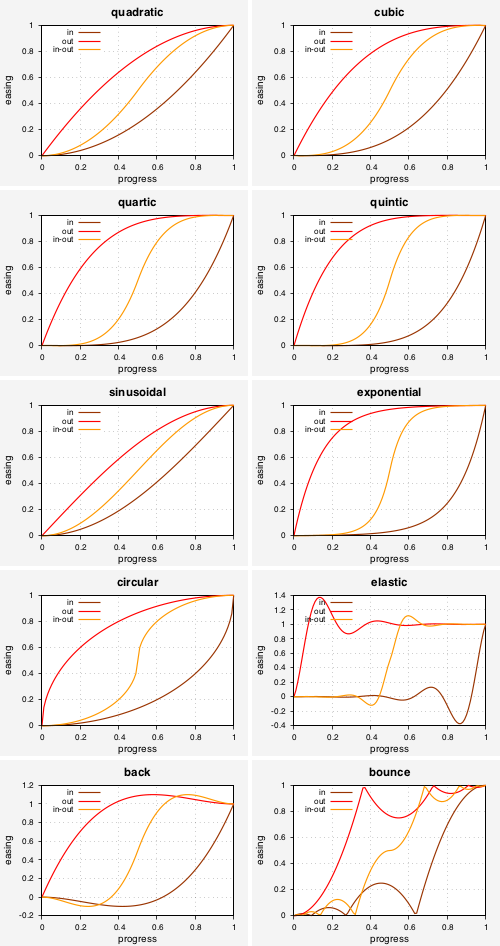

### Other easings

- squareroot
- cuberoot

The `squareroot` & `cuberoot` easings focus more on the middle regions and less on the extremes, opposite to `quadratic` & `cubic` respectively:

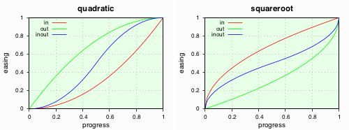

### All easings

Here are all the supported easings superimposed by the [Desmos Graphing Calculator](https://www.desmos.com/calculator):

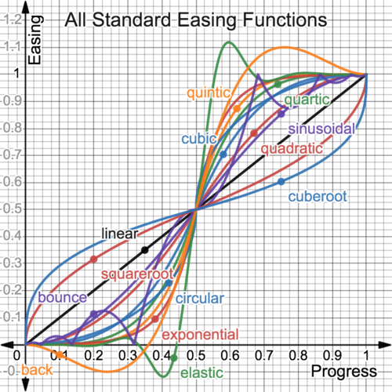

## Transition expressions

### Xfade transitions

These are ports of the C-code transitions in [vf_xfade.c](https://github.com/FFmpeg/FFmpeg/blob/master/libavfilter/vf_xfade.c) for use with easing.
Omitted transitions are `distance`, `hblur`, `fadegrays` which perform aggregation, so cannot be computed efficiently on a per plane-pixel basis.

- fade fadefast fadeslow fadeblack fadewhite
- wipeleft wiperight wipeup wipedown
- wipetl wipetr wipebl wipebr
- slideleft slideright slideup slidedown
- smoothleft smoothright smoothup smoothdown
- circlecrop rectcrop [args: backColor(0=black;!0=white); default: =0]
- circleopen circleclose
- vertopen vertclose horzopen horzclose
- dissolve pixelize
- diagtl diagtr diagbl diagbr
- hlslice hrslice vuslice vdslice
- radial zoomin
- squeezeh squeezev
- hlwind hrwind vuwind vdwind
- coverleft coverright
- coverup coverdown
- revealleft revealright
- revealup revealdown

#### Gallery

See the FFmpeg Wiki [Xfade page](https://trac.ffmpeg.org/wiki/Xfade#Gallery).

### GL Transitions

Below are xfade ports of some of the simpler GLSL transitions at [GL Transitions](https://github.com/gl-transitions/gl-transitions/tree/master/transitions) for use with or without easing.

- gl_angular [args: startingAngle,direction(!0=clockwise); default: =90,0]
- gl_CrazyParametricFun [args: a,b,amplitude,smoothness; default: =4,1,120,0.1]
- gl_crosswarp
- gl_directionalwarp [args: smoothness,direction.x,direction.y; default: =0.1,-1,1]
- gl_kaleidoscope [args: speed,angle,power; default: =1,1,1.5]
- gl_multiply_blend
- gl_pinwheel [args: speed; default: =2]
- gl_polar_function [args: segments; default: =5]
- gl_PolkaDotsCurtain [args: dots,centre.x,centre.y; default: =20,0,0]
- gl_randomsquares [args: size.x,size.y,smoothness; default: =10,10,0.5]
- gl_ripple [args: amplitude,speed; default: =100,50]
- gl_rotate_scale_fade [args: centre.x,centre.y,rotations,scale,backColor(0=black;!0=white); default: =0.5,0.5,1,8,0]
- gl_squareswire [args: squares.h,squares.v,direction.x,direction.y,smoothness; default: =10,10,1.0,-0.5,1.6]
- gl_Swirl
- gl_WaterDrop [args: amplitude,speed; default: =30,30]

> [!NOTE]
> there are better and faster ways to use the complete set of GL Transitions with FFmpeg:  
> [ffmpeg-gl-transition](https://github.com/transitive-bullshit/ffmpeg-gl-transition) is a native FFmpeg filter which requires building ffmpeg from source  
> [ffmpeg-concat](https://github.com/transitive-bullshit/ffmpeg-concat) is a Node.js package which requires installation  
> [xfade_opencl](https://ffmpeg.org/ffmpeg-filters.html#xfade_005fopencl) FFmpeg filter can run custom transition effects from OpenCL source but enablement is quite involved and OpenCL is not not OpenGL

#### With easing

GL Transitions can also be eased, with or without parameters:

*Example*: `Swirl`

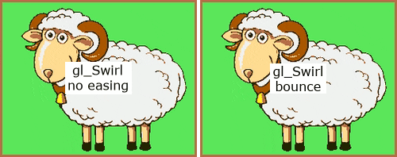

#### Gallery

<!-- GL pics at https://github.com/gre/gl-transition-libs/tree/master/packages/website/src/images/raw -->

Here are the xfade-ported GL Transitions with default parameters and no easing.
See also the [GL Transitions Gallery](https://gl-transitions.com/gallery).


#### Porting

GLSL shader code runs on the GPU in real time. However GL Transition and Xfade APIs are quite similar and simple algorithms are easily ported.

| context | GL Transitions | Xfade filter | notes |
| :---: | :---: | :---: | --- |
| progress | `uniform float progress` <br/> moves from 0 to 1 | `P` <br/> moves from 1 to 0 | `progress ≡ 1 - P` |
| ratio | `uniform float ratio` | `W / H` | GL width and height are normalised |
| coordinates | `vec2 uv` <br/> `uv.y == 0` is bottom <br/> `uv == vec2(1.0)` is top-right | `X`, `Y` <br/> `Y == 0` is top <br/> `(X,Y) == (W,H)` is bottom-right | `uv.x ≡ X / W` <br/> `uv.y ≡ 1 - Y / H` |
| texture | `vec4 getFromColor(vec2 uv)` <hr/> `vec4 getToColor(vec2 uv)` | `a0(x,y)` to `a3(x,y)` <br/> or `A` for first input <hr/> `b0(x,y)` to `b3(x,y)` <br/> or `B` for second input | xfade `expr` is evaluated for every texture component (plane) and pixel position <br/> <br/> `vec4 transition(vec2 uv) {...}` runs for every pixel position |

To make porting easier to follow, the expression generator Bash script [xfade-easing.sh](xfade-easing.sh) replicates as comments the original variable names found in the C or GLSL source code. It also uses pseudo functions to emulate real functions, expanding them inline later.

*Example*: porting transition `gl_randomsquares`

[randomsquares.glsl](https://github.com/gl-transitions/gl-transitions/blob/master/transitions/randomsquares.glsl):
```
uniform ivec2 size; // = ivec2(10, 10)
uniform float smoothness; // = 0.5

float rand (vec2 co) {
    return fract(sin(dot(co.xy ,vec2(12.9898,78.233))) * 43758.5453);
}

vec4 transition(vec2 p) {
    float r = rand(floor(vec2(size) * p));
    float m = smoothstep(0.0, -smoothness, r - (progress * (1.0 + smoothness)));
    return mix(getFromColor(p), getToColor(p), m);
}
```
[xfade-easing.sh](xfade-easing.sh):
```
_make "st(1, ${a[0]-10});" # size.x
_make "st(2, ${a[1]-10});" # size.y
_make "st(3, ${a[2]-0.5});" # smoothness
_make 'st(1, floor(ld(1) * X / W));'
_make 'st(2, floor(ld(2) * (1 - Y / H)));'
_make 'st(4, frand(ld(1), ld(2), 4));' # r (frand(...) == fract(sin(dot(... algorithm)
_make 'st(4, ld(4) - ((1 - P) * (1 + ld(3))));'
_make 'st(4, smoothstep(0, -ld(3), ld(4), 4));' # m
_make 'mix(A, B, ld(4))'
```
Here, `frand()`, `smoothstep()` and `mix()` are pseudo functions.
Customizable parameters get stored first.
`_make` is just an expression string builder function.

### Other transitions

Transition `x_screen_blend` is the opposite of `gl_multiply_blend`; they lighten and darken the transition respectively.
Use `x_overlay_blend` to boost contrast by combining multiply and screen blends.

- x_screen_blend
- x_overlay_blend

### Parameters

Many GL Transitions accept parameters to tweak the transition effect.
Some Xfade transitions have been altered to also accept parameters.
The parameters and default values are shown above, [here](#xfade-transitions) and [here](#gl-transitions).

Using [xfade-easing.sh](#expression-generator-cli-script), parameters can be appended to the transition name as CSV.

*Example*: two pinwheel speeds: `-t gl_pinwheel=0.5` and `-t gl_pinwheel=10`

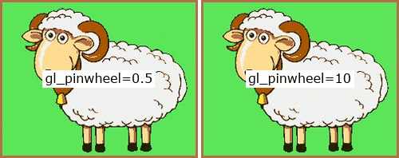

Alternatively just hack the [expressions](expr) directly.
The parameters are specified first, using store functions `st(p,v)`
where `p` is the parameter number and `v` its value.
So for `gl_pinwheel` with a `speed` value 10, change the first line of its expr below to `st(1, 10);`.
```
st(1, 2);
st(1, atan2(0.5 - Y / H, X / W - 0.5) + (1 - P) * ld(1));
st(1, mod(ld(1), PI / 4));
st(1, sgn(1 - P - ld(1)));
st(1, if(lt(0.5, ld(1)), 0, 1));
A * ld(1) + B * (1 - ld(1))
```
Similarly, `gl_directionalwarp` takes 3 parameters: `smoothness`, `direction.x`, `direction.y` (from `xfade-easing.sh -L`)
and its expr starts with 3 corresponding `st()` (store) functions which may be changed from their default values:
```
st(1, 0.1);
st(2, -1);
st(3, 1);
st(4, hypot(ld(2), ld(3)));
etc.
```

## Expression generator CLI script

[xfade-easing.sh](xfade-easing.sh) is a Bash 4 script that generates custom easing and transition expressions for the xfade `expr` parameter.
It can also generate easing graphs via gnuplot and demo videos for testing.

### Usage
```
FFmpeg Xfade Easing script (xfade-easing.sh version 1.3) by Raymond Luckhurst, scriptit.uk
Generates custom xfade filter expressions for rendering transitions with easing.
See https://ffmpeg.org/ffmpeg-filters.html#xfade & https://trac.ffmpeg.org/wiki/Xfade
Usage: xfade-easing.sh [options]
Options:
    -f pixel format (default: rgb24): use ffmpeg -pix_fmts for list
    -t transition name (default: fade); use -L for list
    -e easing function (default: linear); see -L for list
    -m easing mode (default: inout): in out inout
    -x expr output filename (default: no expr), accepts expansions, - for stdout
    -a append to expr output file
    -s expr output format string (default: '%x')
       %t expands to the transition name; %e easing name; %m easing mode
       %T, %E, %M upper case expansions of above
       %a expands to the transition arguments; %A to the default arguments (if any)
       %x expands to the generated expr, condensed, intended for inline filterchains
       %X does too but is not condensed, intended for -filter_complex_script files
       %y expands to the easing expression only, inline; %Y script
       %z expands to the eased transition expression only, inline; %Z script
          for the uneased transition expression only, use -e linear (default) and %x or %X
       %n inserts a newline
    -p easing plot output filename (default: no plot)
       accepts expansions but %m/%M are pointless as plots show all easing modes
       formats: gif, jpg, png, svg, pdf, eps, html <canvas>, determined from file extension
    -c canvas size for easing plot (default: 640x480, scaled to inches for PDF/EPS)
       format: WxH; omitting W or H keeps aspect ratio, e.g -z x300 scales W
    -v video output filename (default: no video), accepts expansions
       formats: animated gif, mp4 (x264 yuv420p), mkv (FFV1 lossless) from file extension
       if gifsicle is available then gifs will be optimised
    -i video inputs CSV (2 or more needed, default: sheep,goat - inline pngs 250x200)
    -z video size (default: input 1 size)
       format: WxH; omitting W or H keeps aspect ratio, e.g -z 300x scales H
    -l video length per transition (default: 5s)
       total length is this length times (number of inputs - 1)
    -d video transition duration (default: 3s)
    -r video framerate (default: 25fps)
    -n show effect name on video as text (requires the libfreetype library)
    -u video text font size multiplier (default: 1.0)
    -2 video stack orientation,gap,colour (default: ,0,white), e.g. h,2,red
       stacks uneased and eased videos horizontally (h), vertically (v) or auto (a)
       auto (a) selects the orientation that displays easing to best effect
       also stacks transitions with default and custom parameters, eased or not
       videos are not stacked unless they are different (nonlinear or customised)
    -L list all transitions and easings
    -H show this usage text
    -V show the script version
    -T temporary file directory (default: /tmp)
    -K keep temporary files if temporary directory is not /tmp
Notes:
    1. point the shebang path to a bash4 location (defaults to MacPorts install)
    2. this script requires Bash 4 (2009), gawk, gsed, envsubst, ffmpeg, gnuplot, base64
    3. use -filter_complex_threads 1 ffmpeg option (slower!) because xfade expressions
       are not thread-safe (the st() & ld() functions use contextual allocation)
    4. certain xfade transitions are not implemented because they perform aggregation
       (distance, fadegrays, hblur)
    5. a few GL Transitions are also ported, some of which take parameters;
       to override the default parameters append as CSV after an = sign,
       e.g. -t gl_PolkaDotsCurtain=10,0.5,0.5 for 10 dots centred
       (see https://gl-transitions.com/gallery)
    6. many transitions do not lend themselves well to easing, and easings that overshoot
       (back & elastic) may cause weird effects!
```
### Generating expr code

- `xfade-easing.sh -t slideright -e quadratic -m out -x -`  
prints expr for slideright transition with quadratic-out easing to stdout
- `xfade-easing.sh -t coverup -e quartic -m in -x coverup-quartic_in.txt`  
prints expr for coverup transition with quartic-in easing to file coverup-quartic_in.txt
- `xfade-easing.sh -t coverup -e quartic -m in -x %t-%e_%m.txt`  
ditto, using expansion specifiers in file name
- `xfade-easing.sh -t rectcrop -e exponential -m inout -s "\$expr['%t_%e_%m'] = '%n%X';" -x exprs.php -a`  
appends the following to file exprs.php:
```php
$expr['rectcrop_exponential_inout'] = '
st(0, if(gt(P, 0.5), if(eq(P, 1), 1, 1 - 2^(9 - 20 * P)), if(eq(P, 0), 0, 2^(20 * P - 11))))
;
st(1, abs(ld(0) - 0.5) * W);
st(2, abs(ld(0) - 0.5) * H);
st(3, lt(abs(X - W / 2), ld(1) * lt(abs(Y - H / 2), ld(2))));
st(4, if(lt(ld(0), 0.5), B, A));
if(not(ld(3)), if(lt(PLANE,3), 0, 255), ld(4))';
```
- `xfade-easing.sh -t gl_multiply_blend -s "expr='%n%X'" -x fc-script.txt -a`  
This is not eased, therefore the expr appended to fc-script.txt uses progress `P` directly:
```shell
expr='
st(1, A * B / 255);
st(2, 2 * (1 - P));
if(gt(P, 0.5), ld(1) * ld(2) + A * (1 - ld(2)), st(2, ld(2) - 1); B * ld(2) + ld(1) * (1 - ld(2)))'
```

### Generating test plots

Plot data is generated using the `print` function of the ffmpeg expression evaluator for the first plane and first pixel as xfade progress `P` goes from 1 to 0 at 100fps.
It is therefore actual expression data.

- `xfade-easing.sh -e elastic -p plot-%e.pdf`  
creates a PDF file plot-elastic.pdf of the elastic easing
- `xfade-easing.sh -e bounce -p %e.png -c 500x`  
creates image file bounce.png of the bounce easing scaled to 500px wide:

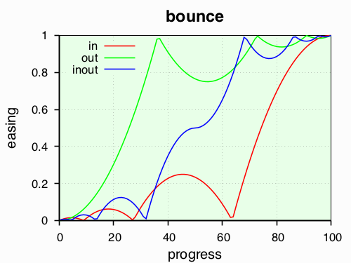

The plots above in [Standard easings](#standard-easings-robert-penner) show the test plots for all standard easings and all three modes (in, out and in-out).

### Generating demo videos

> [!NOTE]
> all demos on this page show animated GIFs of transition effects on still images except for the first demo [wipedows cubic](#example-wipedown-with-cubic-easing) which has video inputs

- `xfade-easing.sh -t hlwind -e quintic -m in -v windy.gif`  
creates an animated GIF image of the hlwind transition with quintic-in easing  


- `xfade-easing.sh -t radial -e squareroot -m inout -v %t-%e.mp4 -n -u 1.5`  
creates a video annotated in larger text using expansion specifiers for the file name  
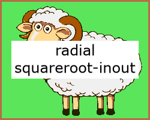

- `xfade-easing.sh -t gl_polar_function=25 -i islands.png,rainbow.png -v paradise.mkv`  
creates a lossless (FFV1) video (e.g. for further processing) of a GL transition with given parameters between specified inputs  
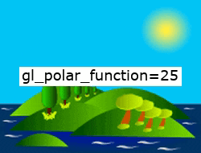

- `xfade-easing.sh -t gl_angular=0,1 -e exponential -i street.png,road.png,flowers.png,bird.png,barley.png -v multiple.mp4 -z 250x`  
creates a video of the GL transition `angular` with parameter `startingAngle=0` (west) and `clockwise=1` (an added parameter) for 5 inputs  
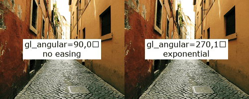

- `xfade-easing.sh -t circlecrop=1 -e quartic -i phone.png,beach.png -v home-away.mp4 -l 10 -d 8 -z 246x -2 h,8,LightSkyBlue -n`  
creates a 10s video of the Xfade transition `circlecrop` with white background (added parameter), horizontally stacked with 8px `LightSkyBlue` gap (see [Color](https://ffmpeg.org/ffmpeg-utils.html#Color)), with a slow 8s transition and quartic easing  
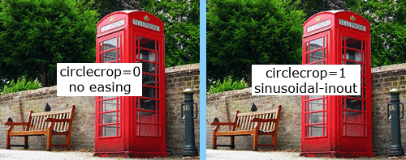

- `xfade-easing.sh -t gl_PolkaDotsCurtain=10,0.5,0.5 -e quadratic -i balloons.png,fruits.png -v living-life.mp4 -l 7 -d 5 -z 500x -r 30 -f yuv420p`  
a 5 second GL transition with arguments and gentle quadratic easing, running at 30fps for 7 seconds, processing in YUV (Y'CbCr) colour space throughout  


## See also

- [FFmpeg Xfade filter](https://ffmpeg.org/ffmpeg-filters.html#xfade) reference documentation
- [FFmpeg Wiki Xfade page](https://trac.ffmpeg.org/wiki/Xfade) with gallery
- [FFmpeg Expression Evaluation](https://ffmpeg.org/ffmpeg-utils.html#Expression-Evaluation) reference documentation
- [Robert Penner’s Easing Functions](http://robertpenner.com/easing/) the original, from 2001
- [Michael Pohoreski’s Easing Functions](https://github.com/Michaelangel007/easing#tldr-shut-up-and-show-me-the-code) single oarameter versions of Penner’s Functions
- [GL Transitions homepage](https://gl-transitions.com) and [Gallery](https://gl-transitions.com/gallery) and [Editor](https://gl-transitions.com/editor)
- [GL Transitions repository](https://github.com/gl-transitions/gl-transitions) on GitHub
- [OpenGL Reference Pages](https://registry.khronos.org/OpenGL-Refpages/gl4/)
- [libavfilter/vf_xfade.c](https://github.com/FFmpeg/FFmpeg/blob/master/libavfilter/vf_xfade.c) xfade C code
- [libavutil/eval.c](https://github.com/FFmpeg/FFmpeg/blob/master/libavutil/eval.c) expr C code
- [ffmpeg-gl-transition](https://github.com/transitive-bullshit/ffmpeg-gl-transition) native FFmpeg GL Transitions filter
- [ffmpeg-concat](https://github.com/transitive-bullshit/ffmpeg-concat) Node.js package, concats videos with GL Transitions
