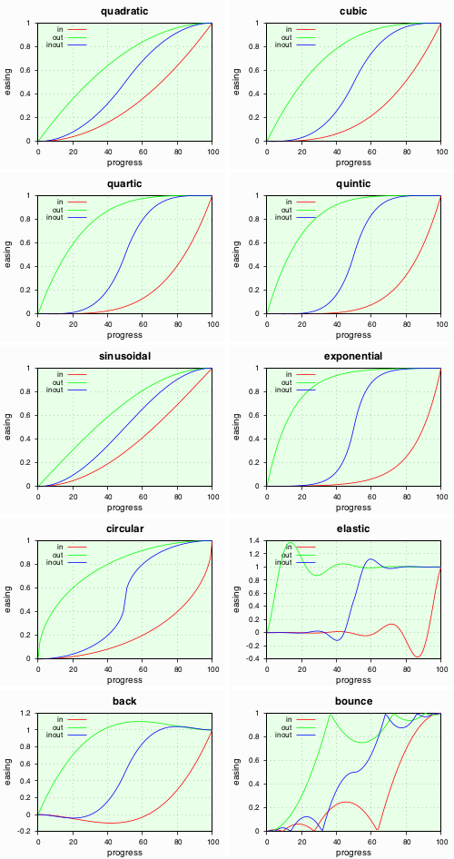
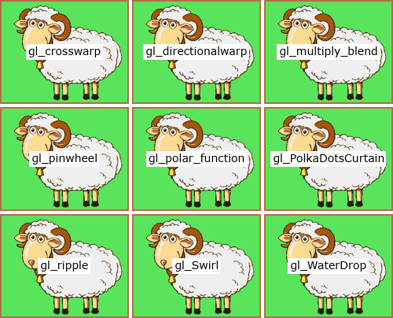

# xfade-easing
> [!NOTE]  
> Still working on this Readme!
## Summary

Xfade is a FFmpeg video transition filter which provides an expression evaluator for custom effects.

This is a port of Robert Penner’s standard easing equations coded as custom xfade expressions.
It also ports most xfade transitions, some [GL Transitions](https://github.com/gl-transitions/gl-transitions) and other transitions for use in tandem with the easing expressions to ease the transition effect.

Deployment involves setting the xfade `transition` parameter to `custom` and the `expr` parameter to the concaternation of an easing expression and a transition expression.
Pre-generated [expressions](expr) can be copied verbatim but an [expression generator](#expression-generator-cli-script) is provided.

*Example*: wipedown with cubic easing:


```shell
ffmpeg -i first.mp4 -i second.mp4 -filter_complex_threads 1 -filter_complex "
    xfade=duration=3:offset=1:transition=custom:expr='
        st(0,1-P); st(1,if(gt(P,0.5),4*ld(0)^3,1-4*P^3)); st(0,1-ld(1)) ;
        if(gt(Y,H*(1-ld(0))),A,B)
    '" output.mp4
```
The `expr` parameter is shown on two lines for clarity.
The first line is the easing expression $e(P)$ (cubic in-out) which stores its calculated progress value in `st(0)`.
The second line is the  transition expression $t(e(P))$ (wipedown) which loads its eased progress value from `ld(0)` instead of $P$.
The semicolon token combines expressions.

> [!NOTE]  
> the example appears overly complicated because xfade progress `P` goes from 1..0 but the easing equations expect 0..1

> [!IMPORTANT] 
> the ffmpeg option `-filter_complex_threads 1` is required because xfade expressions are not thread-safe (the `st()` & `ld()` functions use xfade context memory), consequently processing is slower

## Expressions
Pre-generated easing and transition expressions are in the [expr/](expr) subdirectory for mix and match use.
The [expression generator](#expression-generator-cli-script) can produce combined expressions in any syntax using expansion specifiers (like `printf`).

### Pixel format
Transitions that affect colour components work differently for RGB-type formats than non-RGB colour spaces and for different bit depths.
The generator emulates [vf_xfade.c](https://github.com/FFmpeg/FFmpeg/blob/master/libavfilter/vf_xfade.c) function `config_output()` logic, deducing `AV_PIX_FMT_FLAG_RGB` from the format name (rgb/bgr/etc. see [pixdesc.c](https://github.com/FFmpeg/FFmpeg/blob/master/libavutil/pixdesc.c)) and bit depth from `ffmpeg -pix_fmts` data.
It can then set the black, white and mid plane values correctly.

### Compact, for -filter_complex
This format is crammed into a single line stripped of whitespace.

*Example*: elastic out easing (leaves progress in `st(0)`)
```
st(0,1-P);st(1,1-cos(20*ld(0)*PI/3)/2^(10*ld(0)));st(0,1-ld(1))
```

### Verbose, for -filter_complex_script
This format is best for expressions that are too unwieldy for inline ffmpeg commands.

*Example*: gl_WaterDrop transition (expects progress in `ld(0)`)
```
st(1, 30);
st(2, 30);
st(3, X / W - 0.5);
st(4, 0.5 - Y / H);
st(5, hypot(ld(3), ld(4)));
st(6, A);
if(lte(ld(5), 1 - ld(0)),
 st(1, sin(ld(5) * ld(1) - (1 - ld(0)) * ld(2)));
 st(3, ld(3) * ld(1));
 st(4, ld(4) * ld(1));
 st(3, X + ld(3) * W);
 st(4, Y - ld(4) * H);
 st(6, if(eq(PLANE,0), a0(ld(3),ld(4)), if(eq(PLANE,1), a1(ld(3),ld(4)), if(eq(PLANE,2), a2(ld(3),ld(4)), a3(ld(3),ld(4))))))
);
ld(6) * ld(0) + B * (1 - ld(0))
```

## Easing expressions

### Standard easings (Robert Penner)
This implementation uses [Michael Pohoreski’s](https://github.com/Michaelangel007/easing#tldr-shut-up-and-show-me-the-code) single argument version of [Robert Penner’s](http://robertpenner.com/easing/) easing functions, further optimised by me.

	linear  
	quadratic  
	cubic  
	quartic  
	quintic  
	sinusoidal  
	exponential  
	circular  
	elastic  
	back  
	bounce



### Other easings

	squareroot  
	cuberoot

The `squareroot` & `cuberoot` easings focus more on the middle regions and less on the extremes, opposite to `quadratic` & `cubic` respectively:  


## Transition expressions

### Xfade transitions
These are ports of the C-code transitions in [vf_xfade.c](https://github.com/FFmpeg/FFmpeg/blob/master/libavfilter/vf_xfade.c).
Omitted transitions are `distance`, `hblur`, `fadegrays` which perform aggregation, so cannot be computed on a per plane-pixel basis.

	fade fadefast fadeslow fadeblack fadewhite  
	wipeleft wiperight wipeup wipedown  
	wipetl wipetr wipebl wipebr  
	slideleft slideright slideup slidedown  
	smoothleft smoothright smoothup smoothdown  
	circlecrop rectcrop  
	circleopen circleclose  
	vertopen vertclose horzopen horzclose  
	dissolve pixelize  
	diagtl diagtr diagbl diagbr  
	hlslice hrslice vuslice vdslice  
	radial zoomin  
	squeezeh squeezev  
	hlwind hrwind vuwind vdwind  
	coverleft coverright  
	coverup coverdown  
	revealleft revealright  
	revealup revealdown

#### Gallery
See the FFmpeg Wiki [Xfade page](https://trac.ffmpeg.org/wiki/Xfade#Gallery).

### GL Transitions
These are ports of some of the simpler GLSL transitions at [GL Transitions](https://github.com/gl-transitions/gl-transitions).

	gl_crosswarp  
	gl_directionalwarp [args: smoothness,direction.x,direction.y; default: =0.1,-1,1]  
	gl_multiply_blend  
	gl_pinwheel [args: speed; default: =2]  
	gl_polar_function [args: segments; default: =5]  
	gl_PolkaDotsCurtain [args: dots,centre.x,centre.y; default: =20,0,0]  
	gl_ripple [args: amplitude,speed; default: =100,50]  
	gl_Swirl  
	gl_WaterDrop [args: amplitude,speed; default: =30,30]

#### Parameters
Certain GL Transitions accept parameters which can be appended to the transition name as CSV to generate the xfade custom expr using [xfade-easing.sh](#expression-generator-cli-script).
The parameters and default values are shown above.

*Example*: two pinwheel speeds: `-t gl_pinwheel=0.5` and `-t gl_pinwheel=10`  


Alternatively just hack the [expressions](expr) directly.
The parameters are specified first, using store functions `st(p,v)`
where `p` is the parameter number and `v` its value.
So for `gl_pinwheel` and a `speed` value of 10, change the first line of its expr below to `st(1, 10);`.
```
st(1, 2);
st(1, atan2(0.5 - Y / H, X / W - 0.5) + (1 - P) * ld(1));
st(1, mod(ld(1), PI / 4));
st(1, sgn(1 - P - ld(1)));
st(1, if(lt(0.5, ld(1)), 0, 1));
A * ld(1) + B * (1 - ld(1))
```
Similarly, `gl_directionalwarp` has 3 parameters: `smoothness`, `direction.x`, `direction.y` (from `xfade-easing.sh -L`)
and its expr starts with 3 `st()` (store) functions which may be changed from their default values:
```
st(1, 0.1);
st(2, -1);
st(3, 1);
st(4, hypot(ld(2), ld(3)));
etc.
```

#### With easing
GL Transitions can also be eased, with or without parameters:

*Example*: Swirl: `-t gl_Swirl -e bounce`  


#### Gallery
Here are the xfade-ported GL Transitions with default parameters and no easing.
See also the [GL Transitions Gallery](https://gl-transitions.com/gallery).



### Other transitions
Transition `x_screen_blend` is the opposite of `gl_multiply_blend`; they lighten and darken the transition respectively.
Use `x_overlay_blend` to boost contrast by combining multiply and screen blends.

	x_screen_blend  
	x_overlay_blend

## Expression generator CLI script
[xfade-easing.sh](xfade-easing.sh) is a Bash 4 script that generates custom easing and transition expressions for the xfade `expr` parameter.
It can also generate easing graphs via gnuplot and demo videos for testing.

### Usage
```
FFmpeg Xfade Easing script (xfade-easing.sh version 1.1c) by Raymond Luckhurst, scriptit.uk
Generates custom xfade filter expressions for rendering transitions with easing.
See https://ffmpeg.org/ffmpeg-filters.html#xfade & https://trac.ffmpeg.org/wiki/Xfade
Usage: xfade-easing.sh [options]
Options:
    -f pixel format (default: rgb24): use ffmpeg -pix_fmts for list
    -t transition name (default: fade); use -L for list
    -e easing function (default: linear); see -L for list
    -m easing mode (default: inout): in out inout
    -x expr output filename (default: no expr), accepts expansions, - for stdout
    -a append to expr output file
    -s expr output format string (default: '%x')
       %t expands to the transition name; %e easing name; %m easing mode
       %T, %E, %M upper case expansions of above
       %a expands to the transition arguments; %A to the default arguments (if any)
       %x expands to the generated expr, compact, best for inline filterchains
       %X does too but is more legible, good for filter_complex_script files
       %y expands to the easing expression only, compact; %Y legible
       %z expands to the eased transition expression only, compact; %Z legible
          for the uneased transition expression only, use -e linear (default) and %x or %X
       %n inserts a newline
    -p easing plot output filename (default: no plot)
       accepts expansions but %m/%M are pointless as plots show all easing modes
       formats: gif, jpg, png, svg, pdf, eps, html <canvas>, determined from file extension
    -c canvas size for easing plot (default: 640x480, scaled to inches for PDF/EPS)
       format: WxH; omitting W or H keeps aspect ratio, e.g -z x300 scales W
    -v video output filename (default: no video), accepts expansions
       formats: animated gif, mp4 (x264 yuv420p), mkv (FFV1 lossless) from file extension
    -i video inputs CSV (default: sheep,goat - inline pngs 250x200)
    -z video size (default: input 1 size)
       format: WxH; omitting W or H keeps aspect ratio, e.g -z 300x scales H
    -l video length (default: 5s)
    -d video transition duration (default: 3s)
    -r video framerate (default: 25fps)
    -n show effect name on video as text
    -u video text font size multiplier (default: 1.0)
    -2 video stack orientation,gap,colour (default: ,0,white), e.g. h,2,red
       stacks uneased and eased videos horizontally (h), vertically (v) or auto (a)
       auto (a) selects the orientation that displays easing to best effect
       also stacks transitions with default and custom parameters, eased or not
       videos are not stacked unless they are different (nonlinear or customised)
    -L list all transitions and easings
    -H show this usage text
    -V show the script version
    -T temporary file directory (default: /tmp)
    -K keep temporary files if temporary directory is not /tmp
Notes:
    1. point the shebang path to a bash4 location (defaults to MacPorts install)
    2. this script requires Bash 4 (2009), gawk, gsed, envsubst, ffmpeg, gnuplot, base64
    3. use -filter_complex_threads 1 ffmpeg option (slower!) because xfade expressions
       are not thread-safe (the st() & ld() functions use contextual allocation)
    4. certain xfade transitions are not implemented because they perform aggregation
       (distance, fadegrays, hblur)
    5. a few GL Transitions are also ported, some of which take parameters;
       to override the default parameters append as CSV after an = sign,
       e.g. -t gl_PolkaDotsCurtain=10,0.5,0.5 for 10 dots centred
       (see https://gl-transitions.com/gallery)
    6. many transitions do not lend themselves well to easing, and easings that overshoot
       (back & elastic) may cause weird effects!
```
### Generating expr code
### Generating test plots
### Generating demo videos
### Examples
