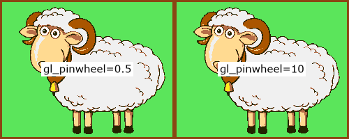

# xfade-easing
> [!NOTE]  
> Still working on this Readme!
## Overview

XFade is a video transition filter for FFmpeg which facilitates custom transition effects using a built-in expression evaluator.

This project is a port of Robert Penner’s easing equations coded as custom xfade expressions.

It also ports most xfade transitions, some [GL Transitions](https://github.com/gl-transitions/gl-transitions) and other transitions, for use in tandem with the easing expressions to ease the transition rate

**Example**: wipedown with cubic easing:  

```bash
ffmpeg -i first.mp4 -i second.mp4 -filter_complex_threads 1 -filter_complex "
       xfade=duration=3:offset=1:transition=custom:expr='
           st(0, 1 - P); st(1, if(gt(P, 0.5), 4 * ld(0)^3, 1 - 4 * P^3)); st(0, 1 - ld(1))
           ;
           if(gt(Y, H * (1 - ld(0))), A, B)
       '" output.mp4
```
The `expr` is shown on three lines. The first line is the easing expression $e(P)$ (cubic in-out) which stores its calculated progress value in `st(0)`; the third line is the  transition expression $t(e(P))$ (wipedown) which loads its eased progress value from `ld(0)` instead of $P$; the second line, a semicolon, separates the easing and transition expressions for clarity.

> [!NOTE]  
> the example appears overly complicated because xfade progress `P` goes from 1..0 but the easing equations expect 0..1

> [!WARNING] 
> the ffmpeg option `-filter_complex_threads 1` is required because xfade expressions are not thread-safe (the `st()` & `ld()` functions use xfade context memory)

## Expressions
### Compact, for -filter_complex
### Verbose, for -filter_complex_script
### Plots, for testing
### Videos, for viewing

## Easing expressions

### Robert Penner easings
This implementation uses [Michael Pohoreski’s](https://github.com/Michaelangel007/easing) single argument version of [Robert Penner’s](http://robertpenner.com/easing/) easing functions, further optimised by me.

	linear  
	quadratic  
	cubic  
	quartic  
	quintic  
	sinusoidal  
	exponential  
	circular  
	elastic  
	back  
	bounce

### Other easings
The `squareroot` & `cuberoot` easings focus more on the middle regions and less on the extremes, opposite to `quadratic` & `cubic` respectively:  


	squareroot  
	cuberoot

## Transition expressions

### XFade transitions
These are ports of the C-code transitions in [vf_xfade.c](https://github.com/FFmpeg/FFmpeg/blob/master/libavfilter/vf_xfade.c).
Omitted transitions are `distance`, `hblur` & `fadegrays` which perform aggregation, so cannot be computed on a plane-pixel basis.

	fade fadefast fadeslow fadeblack fadewhite  
	wipeleft wiperight wipeup wipedown  
	wipetl wipetr wipebl wipebr  
	slideleft slideright slideup slidedown  
	smoothleft smoothright smoothup smoothdown  
	circlecrop rectcrop  
	circleopen circleclose  
	vertopen vertclose horzopen horzclose  
	dissolve pixelize  
	diagtl diagtr diagbl diagbr  
	hlslice hrslice vuslice vdslice  
	radial zoomin  
	squeezeh squeezev  
	hlwind hrwind vuwind vdwind  
	coverleft coverright  
	coverup coverdown  
	revealleft revealright  
	revealup revealdown

### GL Transitions
These are ports of some of the simpler GLSL-code transitions at [GL Transitions](https://github.com/gl-transitions/gl-transitions).

	gl_crosswarp  
	gl_directionalwarp [args: smoothness,direction.x,direction.y default: =0.1,-1,1]  
	gl_multiply_blend  
	gl_pinwheel [args: speed default: =2]  
	gl_polar_function [args: segments default: =5]  
	gl_PolkaDotsCurtain [args: dots,centre.x,centre.y default: =20,0,0]  
	gl_ripple [args: amplitude,speed default: =100,50]  
	gl_Swirl  
	gl_WaterDrop [args: amplitude,speed default: =30,30]

#### Parameters
Certain GL Transitions accept parameters which are appended to the transition name as CSV.
The parameters and default values are shown above.

**Example**: 2 pinwheel speeds using `-t gl_pinwheel=0.5` and `-t gl_pinwheel=10`  


### Other transitions
Transition `x_screen_blend` is the opposite of `gl_multiply_blend`; they lighten and darken the transition respectively.
`x_overlay_blend` combines multiply and screen modes with the effect of boosting contrast.

	x_screen_blend  
	x_overlay_blend

## Expression generator CLI script
xfade-easing.sh is a Bash 4 script that generates the custom easing and transition expressions for the xfade `expr` parameter.
It can also generate easing graphs via gnuplot and demo videos for testing.

### Usage
```
FFmpeg XFade Easing script (xfade-easing.sh version 1.1) by Raymond Luckhurst, scriptit.uk
Generates custom xfade filter expressions for rendering transitions with easing.
See https://ffmpeg.org/ffmpeg-filters.html#xfade & https://trac.ffmpeg.org/wiki/Xfade
Usage: xfade-easing.sh [options]
Options:
    -f pixel format (default: rgb24): use ffmpeg -pix_fmts for list
    -t transition name (default: fade): use -L for list
    -e easing function (default: linear; standard Robert Penner easing functions):
       see -L for list
    -m easing mode (default: inout): in out inout
    -x expr output filename (default: no expr), accepts expansions
    -a append to expr output file
    -s expr output format string (default: '%x')
       %t expands to the transition name; %e easing name; %m easing mode
       %T, %E, %M upper case expansions of above
       %a expands to the transition arguments; %A to the default arguments (if any)
       %x expands to the generated expr, compact, best for inline filterchains
       %X does too but is more legible, good for filter_complex_script files
       %y expands to the easing expression, compact; %Y legible
       %z expands to the transition expression, compact; %Z legible
       %n inserts a newline
    -p easing plot output filename (default: no plot)
       accepts expansions but %m/%M is pointless as plots show all easing modes
       formats: gif, jpg, png, svg, pdf, eps, html <canvas>, determined from file extension
    -c canvas size for easing plot (default: 640x480, scaled to inches for EPS)
       format: WxH; omitting W or H scales to ratio 4:3, e.g -z x300 scales W
    -v video output filename (default: no video), accepts expansions
       formats: gif, mp4 (x264 yuv420p), determined from file extension
    -z video size (default: 250x200)
       format: WxH; omitting W or H scales to ratio 5:4, e.g -z 300x scales H
    -l video length (default: 5)
    -d video transition duration (default: 3)
    -r video framerate (default: 25)
    -n show effect name on video as text
    -2 stack uneased and eased videos horizontally (h), vertically (v) or auto (a)
       auto selects the orientation that displays the easing to best effect
       stacking nly works for non-linear easings (default: no stack)
    -L list all transitions and easings
    -H show this usage text
    -V show the script version
    -T temporary file directory (default: /tmp)
    -K keep temporary files if temporary directory is not /tmp
Notes:
    1. point the shebang path to a bash4 location (defaults to MacPorts install)
    2. this script requires Bash 4 (2009), gawk, gsed, envsubst, ffmpeg, gnuplot, base64
    3. use -filter_complex_threads 1 ffmpeg option (slower!) because xfade expressions
       are not thread-safe (the st() & ld() functions use contextual allocation)
    4. certain xfade transitions are not implemented because they perform aggregation
       (distance, fadegrays, hblur)
    5. a few GL Transitions are also ported, some of which take parameters;
       to override the default parameters append as CSV after an = sign,
       e.g. -t gl_PolkaDotsCurtain=10,0.5,0.5 for 10 dots centred
       (see https://gl-transitions.com/gallery)
    6. many transitions do not lend themselves well to easing, and easings that overshoot
       (back & elastic) may cause weird effects!
``
### Examples
#### Generating expression code
#### Generating easing plots
#### Generating demo videos
