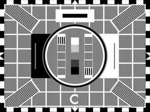

# Easing and extensions for FFmpeg Xfade filter

### Standard easings &bull; CSS easings &bull; ported GLSL transitions &bull; custom expressions 

## Summary

This project is a port of standard easing equations, [CSS easings](#css-easings) and many [GLSL transitions](#ported-glsl-transitions) for use in tandem with easing or alone.
The easing expressions can be used for [other filters](#easing-other-filters) besides xfade.


There are 2 variants:
1. **custom ffmpeg** build with added xfade `easing` and `reverse` options
2. **custom expressions** for use with standard ffmpeg

Xfade is a FFmpeg video transition filter with many built-in transitions and an expression evaluator for custom transitions.
However the progress rate is linear, starting and stopping abruptly and proceeding at constant speed,
therefore transitions lack interest.
Easing inserts a progress envelope to smooth transitions in a natural way.

Example usage:
* **custom ffmpeg**:
set the new `easing` option to the easing name, with optional CSS-easing arguments,
and the `transition` option to the transition name, with optional customisation arguments,
and the `reverse` option to reverse the easing and/or transition effect
(see [reversing](#reversing-xfade-effects)). \
*Example* (quartic-out,radial): \
`xfade=duration=3:offset=10:easing=quartic-out:transition=radial` \
*Example* (CSS,GL,reversed): \
`xfade=duration=3:offset=10:easing='cubic-bezier(0.12,0.57,0.63,0.21)'` \
`:transition='gl_cube(floating=5,unzoom=0.8,background=SlateGray)':reverse=1`

* **custom expression**:
set the xfade `transition` option to `custom` and the `expr` option to the concatenation of a standard easing expression and a transition expression
(this variant does not support CSS easings or reversed effects). \
*Example* (quartic-out,radial): \
`xfade=duration=3:offset=10:transition=custom:expr='st(0,P^4);` \
`st(1,atan2(X-W/2,Y-H/2)-(ld(0)-0.5)*PI*2.5); st(1,st(1,clip(ld(1),0,1))*ld(1)*(3-2*ld(1))); B*ld(1)+A*(1-ld(1))'` \
Pre-generated [expressions](expr) can be copied verbatim from supplied files.

A [CLI wrapper script](#cli-script) is provided to generate custom expressions, test videos, visual media sequences and more.
It also facilitates generic ffmpeg filter easing – see [Easing other filters](#easing-other-filters).

The **custom ffmpeg** variant has backward compatible xfade arguments, is fast with a simple C&nbsp;API and no restrictions.
Installation involves a [few patches](https://htmlpreview.github.io/?https://github.com/scriptituk/xfade-easing/blob/main/src/vf_xfade-diff.html) to a single ffmpeg C source file, with no dependencies.
The **custom expression** variant is convenient but clunky
– see [Performance](#custom-expression-performance) –
and runs on plain vanilla ffmpeg but with restrictions:
it doesn’t support CSS easings, certain transitions, the [reverse](#reversing-xfade-effects) feature, full colour or textures.

At present extended transitions are limited to ported GLSL transitions but more effects may be added downstream.

---

## Example

### wipedown with cubic easing


### CLI command (for custom ffmpeg use)

```shell
ffmpeg -i first.mp4 -i second.mp4 -filter_complex "
    xfade=duration=3:offset=1:easing=cubic-in-out:transition=wipedown
    " output.mp4
```
Easing mode `in-out` is the default mode; the above is equivalent to `easing=cubic`. \
The default easing is `linear` (none).

### CLI command (for custom expression use)

```shell
ffmpeg -i first.mp4 -i second.mp4 -filter_complex_threads 1 -filter_complex "
    xfade=duration=3:offset=1:transition=custom:expr='
        st(0, if(lt(P, 0.5), 4 * P^3, 1 - 4 * (1-P)^3)) ;
        if(gt(Y, H*(1-ld(0))), A, B)
    '" output.mp4
```

Here, the `expr` parameter is shown on two lines for clarity. \
The first line is the easing expression $e(P)$ (`cubic in-out`) which stores its calculated progress value in `st(0)`. \
The second line is the  transition expression $t(e(P))$ (`wipedown`) which loads its eased progress value from `ld(0)` instead of `P`.
The semicolon token combines expressions.

> [!NOTE]
> ffmpeg option `-filter_complex_threads 1` is required because ffmpeg expression state variables (the `st()` & `ld()` functions) are shared between slice processing jobs and therefore not thread-safe, consequently processing is slower

### Getting the expressions

In this example you can copy the easing expression from file [xfade-easings-inline.txt](expr/xfade-easings-inline.txt)
and the transition expression from [eased-transitions-rgb24-inline.txt](expr/eased-transitions-rgb24-inline.txt)
or [eased-transitions-yuv420p-inline.txt](expr/eased-transitions-yuv420p-inline.txt).
Those contain inline expressions for CLI use.

Alternatively use the [CLI script](#cli-script):
```shell
xfade-easing.sh -t wipedown -e cubic -x -
```
dumps the xfade `expr` parameter:
```
'st(0,if(lt(P,0.5),4*P^3,1-4*(1-P)^3));if(gt(Y,H*(1-ld(0))),A,B)'
```

### Using a script

Some expressions are very long, so using a filtergraph script keeps things manageable and readable.

For this same example you can copy the easing expression from file [xfade-easings-script.txt](expr/xfade-easings-script.txt)
and the transition expression from [eased-transitions-rgb24-script.txt](expr/eased-transitions-rgb24-script.txt)
or [eased-transitions-yuv420p-script.txt](expr/eased-transitions-yuv420p-script.txt).
Those contain multiline expressions for script use (but the inline expressions work too).

Alternatively use [xfade-easing.sh](#cli-script) with expansion specifiers `expr='%n%X'` (see [Usage](#usage)):
```shell
xfade-easing.sh -t wipedown -e cubic -s "xfade=offset=10:duration=5:transition=custom:expr='%n%X'" -x script.txt
```
writes the complete xfade filter description to file script.txt:
```
xfade=offset=10:duration=5:transition=custom:expr='
st(0, if(lt(P, 0.5), 4 * P^3, 1 - 4 * (1-P)^3))
;
if(gt(Y, H * (1 - ld(0))), A, B)'
```
and the command becomes
```shell
ffmpeg -i first.mp4 -i second.mp4 -filter_complex_threads 1 -/filter_complex script.txt output.mp4`
```

> [!NOTE]
> this option syntax has changed but is undocumented:
> - for ffmpeg version 7+ use `-/filter_complex filename`
> - for earlier versions use `-filter_complex_script filename`

---

## Custom FFmpeg

### Implementation

For simplicity, native xfade-easing is a [header-only](https://en.wikipedia.org/wiki/Header-only) implementation
in [xfade-easing.h](src/xfade-easing.h) patched into
[vf_xfade.c](https://github.com/FFmpeg/FFmpeg/blob/master/libavfilter/vf_xfade.c) at an optimal place.
It comprises static functions only, sharing internal linkage with the vf_xfade.c compilation unit,
so no Makefile changes are necessary.

### Building – Mac and Linux

1. check the [Compilation Guide](https://trac.ffmpeg.org/wiki/CompilationGuide) and [generic instructions](https://trac.ffmpeg.org/wiki/CompilationGuide/Generic) for any prerequisites, e.g. macOS requires Xcode
1. get the ffmpeg source tree: \
use latest stable release at [Download Source Code](https://ffmpeg.org/download.html) then extract the .xz archive: \
`tar -xJf ffmpeg-x.x.x.tar.xz` or use `xz`/`gunzip`/etc.
1. `cd ffmpeg` and patch libavfilter/vf_xfade.c:
   - download [patched vf_xfade.c](src/vf_xfade.c) which works with latest stable ffmpeg release
   - or use patch file (latest stable release only):
     - download [vf_xfade.patch](src/vf_xfade.patch) to ffmpeg source root
     - run `patch -b -u -N -p0 -i vf_xfade.patch` (saves backup as `vf_xfade.c.orig`)
     - remove `vf_xfade.patch`
   - or patch manually, [click here](https://htmlpreview.github.io/?https://github.com/scriptituk/xfade-easing/blob/main/src/vf_xfade-diff.html), only 9 small changes
1. download [xfade-easing.h](src/xfade-easing.h) to `libavfilter/`
1. install required library packages: \
use a package management tool AptGet/MacPorts/Homebrew/etc.
(if you install ffmpeg itself then its dependencies also get installed ready for the custom build);
export `PATH`,`LD_LIBRARY_PATH`,`LDFLAGS` environment variables to find the package components
1. run `./configure` with any `--prefix` and other options (drawtext requires `--enable-libfreetype` `--enable-libharfbuzz` `--enable-libfontconfig`) \
   to replicate an existing configuration run `ffmpeg -hide_banner -buildconf` and copy-paste the options
   (I maintain a conf file and source that) \
   `./configure` will flag up any missing library packages
1. run `make ECFLAGS=-Wno-declaration-after-statement`, it takes a while \
the C99 code mixes declarations and statements so issues profuse compiler warnings without the `ECFLAGS` setting \
the fix for `ld: warning: text-based stub file are out of sync` warnings [is here](https://stackoverflow.com/a/55344565)
1. if required run `make install` or point `PATH` to the ffmpeg source root
1. test using `ffmpeg -hide_banner --help filter=xfade`: the `xfade AVOptions` should include `easing` and `reverse`

### Building – Windows

#### Cross compiling

Cross compiling using [ffmpeg-windows-build-helpers](https://github.com/rdp/ffmpeg-windows-build-helpers)
on Linux is the method I have had most success with.
It built a static feature-rich ffmpeg.exe with xfade-easing on a [VirtualBox](https://www.virtualbox.org/)
Ubuntu client running on Macos,
but attempting the same process natively on Macos failed – needs investigation.
You need to follow steps 2-4 above first and use the `--ffmpeg-source-dir` option.

#### Native compiling

My repo [ffmpeg-makexe](https://github.com/scriptituk/ffmpeg-makexe) has a Bash script to build ffmpeg with xfade-easing under MSYS2 in two dispositions:

- minimal static build (x264 + zlib) using
  - MSVC toolchain under MSYS2 MSYS environment \
    based on [Roxlu’s guide](https://www.roxlu.com/2019/062/compiling-ffmpeg-with-x264-on-windows-10-using-msvc)
  - ClangCL toolchain under MSYS2 MSYS environment \
    requires Visual Studio [Clang components](https://learn.microsoft.com/en-us/cpp/build/clang-support-msbuild#install-1)
- larger dynamic build using
  - gcc toolchain under MSYS2 UCRT64 environment (ucrt, libstdc++)
  - clang toolchain under MSYS2 CLANG64 environment (ucrt, libc++)
  - gcc toolchain under MSYS2 MINGW64 environment (msvcrt, libstdc++) – not recommended

  these use dynamically-linked `pacman` external components, creating a 7-Zip archive of all non-Windows binaries.

Native Msys2 Windows build using [media-autobuild_suite](https://github.com/m-ab-s/media-autobuild_suite)
is also possible but it broke for me.
Both that and [ffmpeg-windows-build-helpers](https://github.com/rdp/ffmpeg-windows-build-helpers)
are complex scripts promoted by the FFmpeg team.

I have not explored WSL or Cygwin.

### Building – other platforms

Please see the [FFmpeg Compilation Guide](https://trac.ffmpeg.org/wiki/CompilationGuide).

### Binary distribution

FFmpeg contains x264 and other components which require compliance with the GPL.
Therefore I am unable to distribute binary executables of ffmpeg with xfade-easing.

### Testing

The custom FFmpeg version has been built and tested on Macos with `clang`,
Ubuntu Linux and Msys2 with `gcc` and `clang`,
and Windows with `MSVC` and `ClangCL`.

---

## Custom expressions

Pre-generated easing and transition expressions are in the [expr/](expr) subdirectory for mix and match use.
The [CLI script](#cli-script) can produce combined expressions in any syntax using expansion specifiers (like `printf`).

### Inline, for -filter_complex

This format is condensed into a single line stripped of whitespace.

*Example*: `elastic out` easing (leaves progress in `st(0)`)
```
st(0,cos((1-P)*20.944)/2^(10*(1-P)))
```

### Script, for -/filter_complex

This format is best for expressions that are too unwieldy for inline ffmpeg commands.

*Example*: `gl_rotate_scale_fade` transition (expects eased progress in `ld(0)`) (cf. [rotate_scale_fade.glsl](https://github.com/gl-transitions/gl-transitions/blob/master/transitions/rotate_scale_fade.glsl))
```
st(1, 0.5);
st(2, 0.5);
st(3, 1);
st(4, 8);
st(5, X / W - ld(1));
st(6, 1 - Y / H - ld(2));
st(7, hypot(ld(5), ld(6)));
st(5, ld(5) / ld(7));
st(6, ld(6) / ld(7));
st(8, 2 * abs(ld(0) - 0.5));
st(8, ld(7) / (ld(4) * (1 - ld(8)) + ld(8)));
st(3, 2 * PI * ld(3) * (1 - ld(0)));
st(4, sin(ld(3)));
st(3, cos(ld(3)));
st(7, ld(5) * ld(3) - ld(6) * ld(4));
st(6, ld(5) * ld(4) + ld(6) * ld(3));
st(1, ld(1) + ld(7) * ld(8));
st(2, ld(2) + ld(6) * ld(8));
if(between(ld(1), 0, 1) * between(ld(2), 0, 1),
 st(1, ld(1) * W);
 st(2, (1 - ld(2)) * H);
 st(3, ifnot(PLANE, a0(ld(1),ld(2)), ifnot(1-PLANE, a1(ld(1),ld(2)), ifnot(2-PLANE, a2(ld(1),ld(2)), a3(ld(1),ld(2))))));
 st(4, ifnot(PLANE, b0(ld(1),ld(2)), ifnot(1-PLANE, b1(ld(1),ld(2)), ifnot(2-PLANE, b2(ld(1),ld(2)), b3(ld(1),ld(2))))));
 ld(4) * (1 - ld(0)) + ld(3) * ld(0),
 st(1, 0.15);
 if(3-PLANE, max(ld(1), 0), gte(ld(1), 0)) * 255
)
```

### Uneased, for transitions without easing

These use `P` directly for progress instead of `ld(0)`.

*Example*: `gl_WaterDrop` transition (cf. [WaterDrop.glsl](https://github.com/gl-transitions/gl-transitions/blob/master/transitions/WaterDrop.glsl))

```
st(1, 30);
st(2, 30);
st(3, 1 - P);
st(4, X / W - 0.5);
st(5, 0.5 - Y / H);
st(6, hypot(ld(4), ld(5)));
st(7, if(lte(ld(6), ld(3)),
 st(1, sin(ld(6) * ld(1) - ld(3) * ld(2)));
 st(4, ld(4) * ld(1));
 st(5, ld(5) * ld(1));
 st(4, X + ld(4) * W);
 st(5, Y - ld(5) * H);
 ifnot(PLANE, a0(ld(4),ld(5)), ifnot(1-PLANE, a1(ld(4),ld(5)), ifnot(2-PLANE, a2(ld(4),ld(5)), a3(ld(4),ld(5))))),
 A
));
ld(7) * (1 - ld(3)) + B * ld(3)
```

### Generic, for easing other filters

These ease `ld(0)` instead of `P` - see [Easing other filters](#easing-other-filters).

---

## Easing

### Standard easings (Robert Penner)

This implementation derives from [Michael Pohoreski’s](https://github.com/Michaelangel007/easing#tldr-shut-up-and-show-me-the-code) single argument version of [Robert Penner’s](https://robertpenner.com/easing/) easing functions, further optimised by me for the peculiarities of xfade.

- `quadratic`
- `cubic`
- `quartic`
- `quintic`
- `sinusoidal`
- `exponential`
- `circular`
- `elastic`
- `back`
- `bounce`


### Supplementary easings

- `squareroot`
- `cuberoot`

The `squareroot` and `cuberoot` easings focus more on the middle regions and less on the extremes, opposite to `quadratic` and `cubic` respectively:


### All standard and supplementary easings

Here are all the above easings superimposed using the [Desmos Graphing Calculator](https://www.desmos.com/calculator):


### CSS easings

The custom ffmpeg variant supports [CSS Easing Functions Level 2](https://drafts.csswg.org/css-easing-2/) which are too complex for custom expressions:

- `linear` `linear()`
- `ease` `ease-in` `ease-out` `ease-in-out` `cubic-bezier()`
- `step-start` `step-end` `steps()`

#### Linear easing

The new CSS `linear()` function can approximate any progress contour by interpolating between adjacent points,
documented at [W3C here](https://drafts.csswg.org/css-easing-2/#the-linear-easing-function).
There’s a [CSS Linear() Generator](https://linear-easing-generator.netlify.app/) online by its pioneer Jake Archibald to convert easings expressed in JavaScript or SVG to `linear()`.


#### Cubic Bézier easing

There are 4 fixed CSS smoothing curves and a general `cubic-bezier()` easing function
documented at [W3C here](https://drafts.csswg.org/css-easing-2/#cubic-bezier-easing-functions).
See also the [CSS Cubic Bezier Generator](https://www.cssportal.com/css-cubic-bezier-generator/) to craft your own.
The implementation used here is transpiled from Apple’s [open-source Webkit](https://github.com/WebKit/WebKit).


#### Step easing

The CSS `steps()` staircase function is for transitions that jump a constant amount,
documented at [W3C here](https://drafts.csswg.org/css-easing-2/#step-easing-functions).


#### Reversed CSS easing

Standard easings have ease-in and ease-out modes but not CSS easings.
See [Reversing xfade effects](#reversing-xfade-effects) to achieve this with the custom ffmpeg build.

### Overshoots

The `elastic` and `back` easings overshoot and undershoot, causing many transitions to clip and others to show colour distortion.
Therefore they are quite useless for xfade (but see [Easing other filters](#easing-other-filters)).
CSS easings `linear()` and `cubic-bezier()` can also overshoot.

Rendering expressions can only access the two frames of data available.
A wrapping overshoot strategy might work for simple horizontal/vertical effects whereby fetching X & Y pixel data is intercepted
but at present eased progress outside the range 0 to 1 yields unpredictable results.

### Easing other filters

The easing expressions are useful for filters other than xfade,
e.g. blend, drawtext, geq, overlay, rotate, zoompan, etc.
– anywhere an ffmpeg expr is used to calculate filter options.

For this purpose the [CLI script](#cli-script) includes text expansion codes `%g` & `%G` to generate generic easing expressions for the value in `ld(0)` (instead of `P` for xfade), leaving the result in `ld(0)`.
You can also copy generic easing expressions from file [generic-easings-inline.txt](expr/generic-easings-inline.txt) for inline `-filter_complex` use, or [generic-easings-script.txt](expr/generic-easings-script.txt) for `-/filter_complex` scripts.

To ease other filters, store a normalised input value in `st(0,…)`, append the easing expression, then scale the eased result left in `ld(0)`.

*Example*: zoompan filter with `elastic-out` zooming


Here’s the `zoom` option expression for the zoompan filter:
```
zoom='st(0, clip((time - 1) / 3, 0, 1));
        st(0, 1 - cos(ld(0) * 20.944) / 2^(10 * ld(0)));
      lerp(1, 3, ld(0))'
```
The first line stores a 3 second duration delayed by 1 second normalised to a value between 0 and 1. \
The last line scales the result to zoom between 1x and 3x. \
The middle line performs `elastic-out` easing, obtained from [generic-easings-script.txt](expr/generic-easings-script.txt), or \
`xfade-easing.sh -e elastic-out -s %G -x -`

The [zoompan filter](https://ffmpeg.org/ffmpeg-filters.html#zoompan) can produce impressive [Ken Burns effects](https://www.epidemicsound.com/blog/ken-burns-effect/) when `zoom`, `x`, `y` are all dynamic.
Adding easing can take the illusion of motion even further.

*Example*: zoompan with `back` zooming and drawtext with `squareroot` scrolling


The initial zoom here is 1.2x to accommodate the 10% undershoot that `back` easing produces.
So the zoompan `zoom` expression, with `back` expr from [generic-easings-inline.txt](expr/generic-easings-inline.txt), is:
```
z='st(0, clip((time - 1) / 3, 0, 1));
     st(0,if(lt(ld(0),0.5),2*ld(0)*ld(0)*(2*ld(0)*3.59491-2.59491),1-2*(1-ld(0))^2*(4.59491-2*ld(0)*3.59491)));
   lerp(1.2, 3.1, ld(0))'
```
And the drawtext `y` expression with `squareroot` easing is:
```
y='st(0, clip((t - 1) / 3, 0, 1));
     st(0, if(lt(ld(0), 0.5), sqrt(ld(0) / 2), 1 - sqrt((1-ld(0)) / 2)));
   lerp(line_h - 10, h - line_h * 2 - 5, ld(0))'
```

---

## Transitions

### Xfade transitions

For the custom expression variant, xfade transitions are provided as custom expressions for use with easing,
converted from C-code in [vf_xfade.c](https://github.com/FFmpeg/FFmpeg/blob/master/libavfilter/vf_xfade.c).
The custom ffmpeg variant eases the built-in xfade transitions.
Omitted transitions are `distance` and `hblur` which perform aggregation, so cannot be processed efficiently on a per plane-pixel basis.

- `fade` `fadefast` `fadeslow`
- `fadeblack` `fadewhite` `fadegrays`
- `wipeleft` `wiperight` `wipeup` `wipedown`
- `wipetl` `wipetr` `wipebl` `wipebr`
- `slideleft` `slideright` `slideup` `slidedown`
- `smoothleft` `smoothright` `smoothup` `smoothdown`
- `circlecrop` `rectcrop`
- `circleopen` `circleclose`
- `vertopen` `vertclose` `horzopen` `horzclose`
- `diagtl` `diagtr` `diagbl` `diagbr`
- `hlslice` `hrslice` `vuslice` `vdslice`
- `radial` `zoomin`
- `dissolve` `pixelize`
- `squeezeh` `squeezev`
- `hlwind` `hrwind` `vuwind` `vdwind`
- `coverleft` `coverright` `coverup` `coverdown`
- `revealleft` `revealright` `revealup` `revealdown`

#### XFade gallery

Here are the xfade transitions processed using custom expressions instead of the built-in transitions (for testing), without easing –
see also the FFmpeg [Wiki Xfade](https://trac.ffmpeg.org/wiki/Xfade#Gallery) page:


### Ported GLSL transitions

The open collection of [GL Transitions](https://gl-transitions.com/) initiative lead by [Gaëtan Renaudeau](https://github.com/gre) (gre)
“aims to establish an universal collection of transitions that various softwares can use” released under a Free License.

Other GLSL transition sources are from [shadertoy](https://www.shadertoy.com/) and the [Vegas Forum](https://www.vegascreativesoftware.info/us/forum/gl-transitions-gallery-sharing-place-share-the-code-here--133472/).

Most of the transitions at [gl-transitions](https://github.com/gl-transitions/gl-transitions/tree/master/transitions) and many from elsewhere
have been transpiled into native C transitions (for custom ffmpeg variant) and custom expressions (for custom expression variant) for use with or without easing.

All GLSL transitions adapted to the [GL Transition Specification](https://github.com/gl-transitions/gl-transitions#gl-transition-specification-v1) are in [glsl/](glsl/).

The following list shows the transition names, customisation parameters and defaults, and authors:

| transition | parameters (=default) | author |
| :--------: | :-------------------: | :----: |
| gl_angular | `startingAngle=90`<br>`clockwise=0` | Fernando Kuteken |
| gl_Bars | `vertical=0` | Mark Craig |
| gl_blend<sup>*</sup> | `mode=0` | scriptituk |
| gl_BookFlip |  | hong |
| gl_Bounce | `bounces=3`<br>`direction=0`<br>`shadowAlpha=0.6`<br>`shadowHeight=0.075`<br>`shadowColor=0` | Adrian Purser |
| gl_BowTie<sup>*</sup> | `vertical=0` | huynx |
| gl_ButterflyWaveScrawler<sup>*</sup> | `amplitude=1`<br>`waves=30`<br>`colorSeparation=0.3` | mandubian |
| gl_cannabisleaf |  | Flexi23 |
| gl_chessboard | `grid=8` | lql |
| gl_CornerVanish |  | Mark Craig |
| gl_CrazyParametricFun | `a=4`<br>`b=1`<br>`amplitude=120`<br>`smoothness=0.1` | mandubian |
| gl_crosshatch | `center.x=0.5`<br>`center.y=0.5`<br>`threshold=3`<br>`fadeEdge=0.1` | pthrasher |
| gl_CrossOut | `smoothness=0.05` | Mark Craig |
| gl_crosswarp |  | Eke Péter |
| gl_CrossZoom<sup>*</sup> | `strength=0.4`<br>`centerFrom.x=0.25`<br>`centerFrom.y=0.5`<br>`centerTo.x=0.75`<br>`centerTo.y=0.5` | rectalogic |
| gl_cube | `persp=0.7`<br>`unzoom=0.3`<br>`reflection=0.4`<br>`floating=3`<br>`background=0` | gre |
| gl_Diamond | `smoothness=0.05` | Mark Craig |
| gl_DirectionalScaled | `direction.x=0`<br>`direction.y=1`<br>`scale=0.7`<br>`background=0` | Thibaut Foussard |
| gl_directionalwarp | `smoothness=0.1`<br>`direction.x=-1`<br>`direction.y=1` | pschroen |
| gl_doorway | `reflection=0.4`<br>`perspective=0.4`<br>`depth=3`<br>`background=0` | gre |
| gl_DoubleDiamond | `smoothness=0.05` | Mark Craig |
| gl_Dreamy |  | mikolalysenko |
| gl_EdgeTransition<sup>*</sup> | `edgeThickness=0.001`<br>`edgeBrightness=8` | Woohyun Kim |
| gl_Exponential_Swish<sup>*</sup> | `zoom=0.8`<br>`angle=0`<br>`offset.x=0`<br>`offset.y=0`<br>`exponent=4`<br>`wrap.x=2`<br>`wrap.y=2`<br>`blur=0`<br>`background=0` | Boundless |
| gl_fadecolor<sup>*</sup> | `color=0`<br>`colorPhase=0.4` | gre |
| gl_FanIn | `smoothness=0.05` | Mark Craig |
| gl_FanOut | `smoothness=0.05` | Mark Craig |
| gl_FanUp | `smoothness=0.05` | Mark Craig |
| gl_Flower | `smoothness=0.05`<br>`rotation=360` | Mark Craig |
| gl_GridFlip<sup>*</sup> | `size.x=4`<br>`size.y=4`<br>`pause=0.1`<br>`dividerWidth=0.05`<br>`randomness=0.1`<br>`background=0` | TimDonselaar |
| gl_heart |  | gre |
| gl_hexagonalize | `steps=50`<br>`horizontalHexagons=20` | Fernando Kuteken |
| gl_InvertedPageCurl | `angle=100`<br>`radius=0.159`<br>`reverseEffect=0` | Hewlett-Packard |
| gl_kaleidoscope | `speed=1`<br>`angle=1`<br>`power=1.5` | nwoeanhinnogaehr |
| gl_LinearBlur | `intensity=0.1` | gre |
| gl_Lissajous_Tiles<sup>*</sup> | `grid.x=10`<br>`grid.y=10`<br>`speed=0.5`<br>`freq.x=2`<br>`freq.y=3`<br>`offset=2`<br>`zoom=0.8`<br>`fade=3`<br>`background=0` | Boundless |
| gl_morph<sup>*</sup> | `strength=0.1` | paniq |
| gl_Mosaic | `endx=2`<br>`endy=-1` | Xaychru |
| gl_perlin | `scale=4`<br>`smoothness=0.01` | Rich Harris |
| gl_pinwheel | `speed=2` | Mr Speaker |
| gl_polar_function | `segments=5` | Fernando Kuteken |
| gl_PolkaDotsCurtain | `dots=20`<br>`centre.x=0`<br>`centre.y=0` | bobylito |
| gl_powerKaleido | `scale=2`<br>`z=1.5`<br>`speed=5` | Boundless |
| gl_randomNoisex |  | towrabbit |
| gl_randomsquares | `size.x=10`<br>`size.y=10`<br>`smoothness=0.5` | gre |
| gl_ripple | `amplitude=100`<br>`speed=50` | gre |
| gl_Rolls | `type=0`<br>`rotDown=0` | Mark Craig |
| gl_RotateScaleVanish | `fadeInSecond=1`<br>`reverseEffect=0`<br>`reverseRotation=0`<br>`background=0`<br>`trkMat=0` | Mark Craig |
| gl_rotateTransition |  | haiyoucuv |
| gl_rotate_scale_fade | `centre.x=0.5`<br>`centre.y=0.5`<br>`rotations=1`<br>`scale=8`<br>`background=0.15` | Fernando Kuteken |
| gl_SimpleBookCurl<sup>*</sup> | `angle=150`<br>`radius=0.1`<br>`shadow=0.2` | scriptituk |
| gl_SimplePageCurl | `angle=80`<br>`radius=0.15`<br>`roll=0`<br>`reverseEffect=0`<br>`greyBack=0`<br>`opacity=0.8`<br>`shadow=0.2` | Andrew Hung |
| gl_Slides | `type=0`<br>`slideIn=0` | Mark Craig |
| gl_squareswire | `squares.x=10`<br>`squares.y=10`<br>`direction.x=1.0`<br>`direction.y=-0.5`<br>`smoothness=1.6` | gre |
| gl_StageCurtains<sup>*</sup> | `color=0xCC1A33FF`<br>`bumps=15`<br>`drop=0.1` | scriptituk |
| gl_StarWipe | `borderThickness=0.01`<br>`starRotation=0.75`<br>`borderColor=1` | Ben Lucas |
| gl_static_wipe | `upToDown=1`<br>`maxSpan=0.5` | Ben Lucas |
| gl_StereoViewer<sup>*</sup> | `zoom=0.9`<br>`radius=0.25`<br>`flip=0`<br>`background=0`<br>`trkMat=0` | Ted Schundler |
| gl_Stripe_Wipe<sup>*</sup> | `nlayers=3`<br>`layerSpread=0.5`<br>`color1=0x3319CCFF`<br>`color2=0x66CCFFFF`<br>`shadowIntensity=0.7`<br>`shadowSpread=0`<br>`angle=0` | Boundless |
| gl_swap | `reflection=0.4`<br>`perspective=0.2`<br>`depth=3`<br>`background=0` | gre |
| gl_Swirl | `radius=1` | Sergey Kosarevsky |
| gl_WaterDrop | `amplitude=30`<br>`speed=30` | Paweł Płóciennik |
| gl_windowblinds |  | Fabien Benetou |
| gl_windowslice | `count=10`<br>`smoothness=0.5` | gre |

<sup>*</sup> native build only

#### GLSL gallery

<!-- GL pics at https://github.com/gre/gl-transition-libs/tree/master/packages/website/src/images/raw -->

Here are the ported GLSL transitions with default parameters and no easing.
They are all supported by the custom ffmpeg variant but check [above](#ported-glsl-transitions)
for the dozen or so that are not supported by the custom expression variant.

See also the [GL Transitions Gallery](https://gl-transitions.com/gallery)
which lacks many recent contributor transitions plus even more stacking up as
[pull requests](https://github.com/gl-transitions/gl-transitions/pulls) –
which is why I have not added my bundle.


#### With easing

GLSL transitions can also be eased, although easing is integral with some:

*Example*: `Swirl` transition with `bounce` easing


#### Customisation parameters

Many GLSL transitions accept parameters to customise the transition effect.
The parameters and default values are shown [above](#ported-glsl-transitions).

*Example*: two pinwheel speeds: `'gl_pinwheel(0.5)'` and `'gl_pinwheel(10)'`


Parameters are appended to the transition name as CSVs within parenthesis.

For the custom ffmpeg variant the parameters may be name=value pairs in any order,
e.g. `gl_WaterDrop(speed=20,amplitude=50)`,
or they may be indexed values, as follows.

For the custom expression variant the parameters must be indexed values only but empty values assume defaults,
e.g. `gl_GridFlip(5,3,,0.1,,1)` arguments are `size.x=5`,`size.y=3`,`dividerWidth=0.1`,`background=1` with default values for other parameters.

Custom [expressions](expr) can also be amended directly:
parameters are specified using store functions `st(p,v)`
where `p` is the parameter number and `v` its value.
So for `gl_pinwheel` with a `speed` value 10, change the first line of its expr below to `st(1, 10);`.
```
st(1, 2);
st(2, 1 - ld(0));
st(1, atan2(0.5 - Y / H, X / W - 0.5) + ld(2) * ld(1));
st(1, mod(ld(1), PI / 4));
if(lte(ld(2), ld(1)), A, B)
```
Similarly, `gl_directionalwarp` takes 3 parameters: `smoothness`, `direction.x`, `direction.y` (from `xfade-easing.sh -L`)
and its expr starts with 3 corresponding `st()` (store) functions which may be changed from their default values:
```
st(1, 0.1);
st(2, -1);
st(3, 1);
st(4, hypot(ld(2), ld(3)));
etc.
```
#### Altered GLSL transition parameters

- `gl_angular` has an additional `clockwise` parameter
- `gl_Bounce` has an additional `direction` parameter to control bounce direction:
`0`=south, `1`=west, `2`=north, `3`=east; also a `shadowColor` parameter
- `gl_BowTie` combines `BowTieHorizontal` and `BowTieVertical` using parameter `vertical`
- `gl_CrossZoom` has additional `centerFrom`,`centerTo` parameters to tune the cross traversal
- `gl_Exponential_Swish` option `blur` default was originally `0.5` but blurring makes it unacceptably slow
- `gl_InvertedPageCurl` omits anti-aliased edges and takes 3 parameters:
  - `angle` may be `100` (default) or `30` degrees from horizontal east
  - `radius` is the cylinder radius
  - `reverseEffect` produces an uncurl effect (custom ffmpeg only)
- `gl_RotateScaleVanish` has an additional `trkMat` parameter (track matte, custom ffmpeg only) which treats the moving image/video as a variable-transparency overlay – see Dr Who example under [Transparency](#transparency)
- `gl_StereoViewer` (custom ffmpeg only) has an additional `flip` parameter to flip the split angles, a `background` parameter and a `trkMat` parameter
- this implementation provides a `background` parameter for all GL Transitions that show a black background during their transition, e.g. `gl_cube` and `gl_doorway`, see [Colour parameters](#colour-parameters) and [Backgrounds](#backgrounds).

*Example*: `gl_InvertedPageCurl` 30° with uncurl
(useful for sheet music with repeats) \
`'gl_InvertedPageCurl(30,0.15,0)'` and `'gl_InvertedPageCurl(30,0.15,1)'` concatenated


#### Porting

GLSL shader code runs on the GPU in real time unlike ffmpeg.
However GL Transition and Xfade APIs are broadly similar and non-complex algorithms are easily ported using simple vector resolution.

| context | GL Transitions | Xfade filter | notes |
| :---: | :---: | :---: | --- |
| progress | `uniform float progress` <br/> moves from 0&nbsp;to&nbsp;1 | `P` <br/> moves from 1 to 0 | `progress ≡ 1 - P` |
| ratio | `uniform float ratio` | `W / H` | |
| coordinates | `vec2 uv` <br/> `uv.y == 0` is bottom <br/> `uv == vec2(1.0)` is top-right | `X`, `Y` <br/> `Y == 0` is top <br/> `(X,Y) == (W,H)` is bottom-right | GL width and height are normalised <br/> `uv.x ≡ X / W` <br/> `uv.y ≡ 1 - Y / H` |
| texture | `vec4 getFromColor(vec2 uv)` <hr/> `vec4 getToColor(vec2 uv)` | `a0(x,y)` to `a3(x,y)` <br/> or `A` for first input <hr/> `b0(x,y)` to `b3(x,y)` <br/> or `B` for second input | GL colour values are normalised <br/> GL function runs for every pixel <br/> xfade `expr` runs for every component (plane) of every pixel |
| plane data | normalised RGBA | GBRA or YUVA unsigned integer | xfade bit depth depends on pixel format |
| precision | single | double | (float type) |

The custom ffmpeg variant, like GL Transitions, operates on single precision
[unit interval](https://en.wikipedia.org/wiki/Unit_interval)
coordinate and colour data, processing all planes together.
SIMD (Single Instruction Multiple Data) processing is compiler-dependent
but heavy use is made of inline code and optimisation hints.

To make the transpiled code easier to follow,
original variable names from the GLSL and xfade source code are retained in
[xfade-easing.sh](src/xfade-easing.sh) and [xfade-easing.h](src/xfade-easing.h).
The CLI script uses pseudo functions to emulate real functions, expanding them inline later.

*Example*: porting transition `gl_randomsquares`

[randomsquares.glsl](https://github.com/gl-transitions/gl-transitions/blob/master/transitions/randomsquares.glsl):

```glsl
uniform ivec2 size; // = ivec2(10, 10)
uniform float smoothness; // = 0.5

float rand (vec2 co) {
    return fract(sin(dot(co.xy ,vec2(12.9898,78.233))) * 43758.5453);
}

vec4 transition(vec2 p) {
    float r = rand(floor(vec2(size) * p));
    float m = smoothstep(0.0, -smoothness, r - (progress * (1.0 + smoothness)));
    return mix(getFromColor(p), getToColor(p), m);
}
```

[xfade-easing.sh](src/xfade-easing.sh) (custom expression variant):
```shell
gl_randomsquares) # (case)
    _make "st(1, ${a[0]-10});" # size.x
    _make "st(2, ${a[1]-10});" # size.y
    _make "st(3, ${a[2]-0.5});" # smoothness
    _make 'st(1, floor(ld(1) * X / W));'
    _make 'st(2, floor(ld(2) * (1 - Y / H)));'
    _make 'st(4, frand(ld(1), ld(2), 4));' # r
    _make 'st(4, ld(4) - (1 - P) * (1 + ld(3)));'
    _make 'st(4, smoothstep(0, -ld(3), ld(4), 4));' # m
    _make 'mix(A, B, ld(4))'
    ;;
```
Here, `frand()`, `smoothstep()` and `mix()` are pseudo functions.
Customizable parameters are generally stored first.
`_make` is just an expression string builder function.

[xfade-easing.h](src/xfade-easing.h) (custom ffmpeg variant):
```c
static vec4 gl_randomsquares(const XTransition *e)
{
    INIT_BEGIN
    ARG2(ivec2, size, 10, 10)
    ARG1(float, smoothness, 0.5)
    INIT_END
    float r = frand2(floor2(mul2(vec2i(size), e->p)));
    float m = smoothstep(0, -smoothness, r - e->progress * (1 + smoothness));
    return mix4(e->a, e->b, m);
}
```
Here, `vec4` and `ivec2` simulate GLSL vector types
and `XTransition` encapsulates data pertaining to a transition:
```c
typedef struct XTransition {
    float progress; // transition progress, 0.0 to 1.0 (cf. P)
    float ratio; // frame width / height (cf. W / H)
    vec2 p; // pixel position, .y==0 is bottom (cf. X, Y)
    vec4 a, b; // plane data at p (cf. A, B)
    ...
} XTransition;
```
And the extended transitions delegate is:
```c
static void xtransition_transition(AVFilterContext *ctx,
                                   const AVFrame *a, const AVFrame *b,
                                   AVFrame *out,
                                   float progress,
                                   int slice_start, int slice_end, int jobnr)
{
    const XFadeContext *s = ctx->priv;
    const XFadeEasingContext *k = s->k;
    const float mw = k->mw, mh = k->mh, mv = k->mv; // as float
    XTransition e = { // slice data
        .progress = 1 - progress, // 0 to 1 for xtransitions
        .ratio = k->r, // pixel ratio
        .k = k // common context
    };
    // pixel iterator and unit interval conversions
    for (int y = slice_start; y < slice_end; y++) {
        e.p.y = 1 - y / mh; // y=0 is bottom
        for (int x = 0, p = 0; x <= k->mw; x++) {
            e.p.x = x / mw;
            e.a = e.b = VEC4(0, 0.5, 0.5, 1); // plane defaults
            do {
                e.a.p[p] = line(a, p, y)[x] / mv; // from colour
                e.b.p[p] = line(b, p, y)[x] / mv; // to colour
            } while (++p < k->n);
            vec4 c = k->xtransitionf(&e); // transition colour
            do {
                --p;
                line(out, p, y)[x] = scaleUI(c.p[p], k->mv); // clips
            } while (p > 0);
        }
    }
}
```

### Curls and Rolls

#### Transition `gl_InvertedPageCurl`

This is transpiled from the
[InvertedPageCurl](https://github.com/gl-transitions/gl-transitions/blob/master/transitions/InvertedPageCurl.glsl)
GL Transition which originated from the
[WebVfx WebGL pagecurl shader](https://webvfx.rectalogic.com/examples_2transition-shader-pagecurl_8html-example.html)
which is itself based on code by [Calyptus Life AB](https://blog.calyptus.eu/) which seems no longer available.
The Hewlett-Packard accreditation by Sergey Kosarevsky is obscure but preserved here.

#### Transition `gl_SimplePageCurl`

This is adapted from the elegant
[simple page curl effect ](https://www.shadertoy.com/view/ls3cDB) by Andrew Hung
who also provides an excellent [shader breakdown](https://andrewhungblog.wordpress.com/2018/04/29/page-curl-shader-breakdown/)
to demystify the deformation effect. \
It is more versatile than `gl_InvertedPageCurl` and takes the following parameters:
- `angle` may be any 360° angle
  (horizontal east is 0°, curl direction is `angle - 90°` anticlockwise);
  in effect, 1–89° curls from bottom-right; 91–179° top-right; 181–269° (or -91–-179°) top-left; 271–359° (or -1–-89°) bottom-left;
  0° curls upwards; 90° left; ±180° down; 270° (or -90°) right
- `radius` sets the cylinder radius
- `roll` to roll the turning page into a cylinder (`gl_InvertedPageCurl` only rolls)
- `reverseEffect` to uncurl or unroll
- `greyBack` to render overleaf greyscale instead of colour
- `opacity` the underside opacity
- `shadow` the shadow intensity

The main differences from `gl_InvertedPageCurl` are:
- curling in any direction, not just right-to-left at 30° or 100°
- takes aspect ratio into account, ensuring accurate angle
- can render back of turning page either rolling or just curled over
- back of turning page rendered in colour or greyscale with variable opacity
- smaller default radius of 0.15, not 1/2π

*Example*: using `gl_SimplePageCurl` to emulate `gl_InvertedPageCurl` \
`'gl_InvertedPageCurl(30)'` vs `'gl_SimplePageCurl(24.8,0.159,1,0,1,0.8,0.1)'` \
these parameters factor in the aspect ratio (5:4 here), 1/2π radius, roll effect, greyscale overleaf, and shadowing.


There is barely any noticeable difference,
which confirms Mr Hung’s remark that complex mathematics isn’t needed:
just simple trigonometry and scalar product projections.
However `gl_SimplePageCurl` takes longer to process than `gl_InvertedPageCurl`.

*Example*: `gl_SimplePageCurl` with various `angle` and `roll` options
(Abstract and Renaissance art by Kandinsky and Titian)


A by-product effect is a wipe transition in any direction, achieved by setting `radius=0`,`roll=1`.

*Example*: `'gl_SimplePageCurl(160,0,1)'` 160° wipe


#### Transition `gl_SimpleBookCurl`

(custom ffmpeg only)

This is adapted from `gl_SimplePageCurl` to clamp the curl to the virtual ‘spine’ at the horizontal centre,
then flatten the radius to zero, using built-in easing to appear more realistic. \
It takes the following parameters:
- `angle` may be any 360° angle
  (horizontal east is 0°, curl direction is `angle - π/2` anticlockwise);
  in effect, angles from 180° to 359° (or -1° to -180°) page backwards
- `radius` sets the cylinder radius
- `shadow` the shadow intensity

*Example*: `gl_SimpleBookCurl` with various `angle` and `radius` values paging forwards and backwards, rotated and overlaid onto a desk texture
(credit: [Ethical Corporation Magazine](https://1.reutersevents.com/LP=36432))


### Random transitions

The [CLI script](#cli-script) can generate random GLSL-style transitions using the pseudo transition name `gl_random`
which shuffles all the available transition names then cycles through them.
Random transitions are particularly useful for slideshows.
As the random transition is initially unknown, the expression options will not work in this case.

For the custom expression variant which cannot take named parameters,
customisation parameters are ignored and resort to defaults.

For the custom ffmpeg variant which can take named parameters,
a common background colour or transparency or texture can be set using `background`, e.g.: \
`'gl_random(background=black)'` renders a black background (the default) \
`'gl_random(background=white)'` renders a white background \
`'gl_random(background=gray@0.5)'` renders a semi-transparent grey background \
`'gl_random(background=-1)'` renders a transparent background \
`'gl_random(background=-10)'` renders the [texture](#textures) -10 (a rainbow effect) \
and for even more randomness: \
`'gl_random(background=random)'` renders a [random background colour](https://github.com/scriptituk/ffmpeg-colours) picked by ffmpeg \
These affect transitions that take a `background` parameter and have no effect on those that do not.

*Example*: (7 random transitions) \
`xfade-easing.sh -X -t gl_random -v left.mp4 gl*.png` (left, custom expression) \
`xfade-easing.sh -t 'gl_random(background=random)' -v right.mp4 gl*.png` (right, custom ffmpeg)


---

## Colour considerations

### Pixel format

Transitions that affect colour components work differently for RGB than non-RGB colour spaces and for different bit depths.
For the custom expression variant, [xfade-easing.sh](#cli-script) emulates [vf_xfade.c](https://github.com/FFmpeg/FFmpeg/blob/master/libavfilter/vf_xfade.c) function `config_output()` by deducing the RGB signal type `AV_PIX_FMT_FLAG_RGB` from the `-f` option format name (rgb/bgr/etc. see [pixdesc.c](https://github.com/FFmpeg/FFmpeg/blob/master/libavutil/pixdesc.c)) and the bit depth from `ffmpeg -pix_fmts` data.
It can then set the maximum and mid plane values correctly.
See [How does FFmpeg identify color spaces?](https://trac.ffmpeg.org/wiki/colorspace#HowdoesFFmpegidentifycolorspaces) for details.

The expression files in [expr/](expr) cater for RGB and YUV formats with 8-bit component depth.
For faster processing of greyscale media use `xfade-easing.sh -f gray`.
Greyscale is not RGB therefore it is processed like a luma plane.

If in doubt, check with `ffmpeg -pix_fmts` or use the [xfade-easing.sh](#cli-script) `-f` option.

### Colour parameters

These conventions are adopted:
- colour values are interpreted according to sign, magnitude and syntax:
  - values that match the ffmpeg [Color syntax](https://ffmpeg.org/ffmpeg-utils.html#Color)
    are treated as RGBA colour components packed into 32 bits,
    these are values greater than 1 (integers) and ffmpeg colour names
  - values from 0.0 (black) to 1.0 (white) inclusive are an opaque shade of grey
  - values from -0.0 (black) to -1.0 (white) are a transparent shade of grey \
    (-0, negative zero, is recognised; -1 to -2 exclusive get clamped to -1)
  - values -2 or less (integers) select a [texture](#textures)
    (default -2)
- all background colour parameters are named `background`
  (most GL Transition backgrounds are named differently)

Consequently a value of exactly 1 is rendered white but 2 (RGBA `#00000002`) is almost transparent black.
To get R=0,G=0,B=1 specify the colour using hexadecimal notation, `#000001`.

The custom expression variant only suports transparent white and opaque grey values, -1 and 0.0 to 1.0,
it does not support colour or textures. \
e.g. `gl_swap(, , , 0.67)` for 67% grey background (other parameters take default values).

The custom ffmpeg variant supports the full [Color](https://ffmpeg.org/ffmpeg-utils.html#Color) syntax
including named colours and variable alpha, \
e.g. `gl_Stripe_Wipe(color1=DeepSkyBlue, color2=ffd700)`

Colour value examples:
- `CornflowerBlue` (a standard X11 colour name, see [ffmpeg colour names](https://github.com/scriptituk/ffmpeg-colours))
- `0x56789A` or `#56789A` (packed RGB hexadecimal digits)
- `0xA987657F` or `#A98765@0.5` or `A98765@0x7F` (packed RGBA)
- `random` (a random colour generated by ffmpeg)
- `0` (black)
- `1` (white)
- `0.75` (75% grey)
- `bfbfbf7f` (75% grey with 50% alpha)
- `-0.75` (75% grey with 100% alpha, i.e. transparent)
- `-0` (transparent black, negative zero)
- `-1` (transparent white)
- `-2` (moving texture number -2)
- `-3` (still image version of texture -2)
- `12345A` is ambiguous and yields 12345 decimal, or 0x00003039

Avoid decimal numbers above 1, e.g. 255 is not blue but opaque black (RGB `#000000FF`).

*Example*: `gl_StarWipe` transitions with `Lime` and `-15` (still diamond pattern) border colours \
`gl_StarWipe(borderThickness=0.1, borderColor=Lime)` (left) \
`gl_StarWipe(borderThickness=0.1, borderColor=-15)` (right)


### Backgrounds

Many transitions reveal areas which are not painted, exposing a background instead.
Unlike GL Transitions which show a black background,
this implementation provides a `background` parameter which takes a [colour value](#colour-parameters) –
grey or [RGBA colour](https://ffmpeg.org/ffmpeg-utils.html#Color) or [texture](#textures) or transparent
(the custom expression variant only suports grey and transparent).

Transparent background transitions make for good
[overlay](https://ffmpeg.org/ffmpeg-filters.html#overlay-1) effects.
Alternatively, use opaque
[chroma-key](https://ffmpeg.org/ffmpeg-filters.html#chromakey-1) compositing backgrounds,
commonly `#00B140` for green-screen and `#0047BB` or `#0827F5` for blue-screen.

#### Textures

(custom ffmpeg only)

> [!NOTE]
> this features is experimental –
> for generic background effects use the ffmpeg
> [overlay](https://ffmpeg.org/ffmpeg-filters.html#overlay-1) filter
> in conjunction with [transparent](#transparency) xfade-easing.

Textures are shader effects ported from [Shadertoy](https://www.shadertoy.com/),
mainly for transition backgrounds selected with the `background` parameter
but any colour parameter can select a texture – see [Colour parameters](#colour-parameters).
They are referenced by a negative index, where
- even values show a moving texture with linear progress (uneased and non-reversed)
- odd values show a still version of its even-valued texture,
  e.g. -5 is a still of -4 at the halfway point

-2,-3: [Natural vignetting](https://www.shadertoy.com/view/4lSXDm) by ApoorvaJ \
-4,-5: [glowingMarblingBlack](https://www.shadertoy.com/view/WtdXR8) by nasana \
-6,-7: [Monochrome Hyperbola](https://www.shadertoy.com/view/Xtf3WN) by MichaelPohoreski \
-8,-9: [Skyline in 132 chars](https://www.shadertoy.com/view/MtXSR7) by GregRostami \
-10,-11: [simple rainbow formula](https://www.shadertoy.com/view/4l2cDm) by Jodie \
-12,-13: [simple plasma](https://www.shadertoy.com/view/ldBGRR) by Kastor \
-14,-15: [diamond pattern](https://www.shadertoy.com/view/ltX3W4) by rcread \
-16,-17: [Glowing thing](https://www.shadertoy.com/view/4lB3DG) by denzen \
-18,-19: [cinetunnel](https://www.shadertoy.com/view/WdycRw) by tomviolin \
-20,-21: [spring time](https://www.shadertoy.com/view/XllGDH) by bergi \
-22,-23: [Skyline4](https://www.shadertoy.com/view/XlsXRM) by FabriceNeyret2 \
-24,-25: [Water Ripple](https://www.shadertoy.com/view/4cl3W4) by liucc09


*Example*: `gl_DirectionalScaled` transition with `glowingMarblingBlack` background texture and sinusoidal easing \
`gl_DirectionalScaled(direction.x=-1,direction.y=1,scale=0.1,background=-4)`



Textures are useful for all transitions that take a `background` parameter and also for
`gl_fadecolor`, `gl_StarWipe`.

#### Blending

Blending involves compositing image layers according to a blending function and opacity formula,
whereas normal transition colour mixing performs simple linear interpolation in all planes determined by a weight factor.

One exception is the `gl_blend` transition (custom ffmpeg only)
which blends the inputs according to its numerical `mode` parameter.
The first input acts as the backdrop layer and the second as the source layer.
At half the duration, the source is blended over the backdrop according to the blend mode algorithm.
Blend modes available are the [CSS blend modes](https://www.w3.org/TR/compositing-1/#blending)
which use the standard
[PDF 1.7 section 11.3.3](https://opensource.adobe.com/dc-acrobat-sdk-docs/pdfstandards/PDF32000_2008.pdf#page=330)
compositing formula and blending functions, which are quite ubiquitous:


To blend transitions over a backdrop layer use the [blend filter](https://ffmpeg.org/ffmpeg-filters.html#blend-1).
It is poorly documented and the implementation in
[vf_blend.c](https://github.com/FFmpeg/FFmpeg/blob/master/libavfilter/vf_blend.c),
[vf_blend_init.h](https://github.com/FFmpeg/FFmpeg/blob/master/libavfilter/vf_blend_init.h),
[blend_modes.c](https://github.com/FFmpeg/FFmpeg/blob/master/libavfilter/blend_modes.c)
is quite basic: it does not render standard blending as above because it seems to be designed for premultiplied alpha,
achieved for RGB using \
`geq="r='r(X,Y)*alpha(X,Y)/255':g='g(X,Y)*alpha(X,Y)/255':b='b(X,Y)*alpha(X,Y)/255'"` \
before `blend`.

*Example*: four `all_mode` blend options for `gl_StereoViewer` transitions with 50% grey transparency \
`gl_StereoViewer(zoom=0.6,radius=0.3,flip=1,background=-0.5)`


### Transparency

The expression files in [expr/](expr) cater for RGBA and YUVA transparency formats in 4 planes
as well as opaque RGB and YUV in 3 planes and mono/gray in 1 plane.

For lossless intermediate video content with alpha channel support use the [xfade-easing.sh](#cli-script) `-v -f ` options with an alpha format, e.g. `rgba` or `yuva420p`, and .mkv filename extension.

For lossy video with alpha use an alpha format and the .webm extension.
Note: webm encoding is extremely slow and webm alpha is not widely supported.

For animated GIFs with transparency use a non-alpha format and the `-g` option to specify the transparent colour, and the .gif extension.
These require [gifsicle](https://www.lcdf.org/gifsicle/).
Empirically, using an alpha format with the ffmpeg `palettegen` filter and `reserve_transparent` option does not produce faultless transparent animated GIFs, whereas post-processing the opaque image is reliable if the transparent colour is unique.
This needs further investigation.

To specify alpha in transition parameters, see [Colour parameters](#colour-parameters).

*Example*: overlaid transparent `gl_RotateScaleVanish` transition with `quadratic-in` easing
```shell
ffmpeg -i skaro.png -i tardis.png -i gallifrey.png -filter_complex "
    [0]loop=-1:1, fps=25, format=rgba, scale=250:-2[a];
    [1]loop=-1:1, fps=25, format=rgba, scale=250:-2[b];
    [2]loop=-1:1, fps=25, format=rgb24, scale=250:-2[bg];
    [a][b]xfade=offset=1:duration=3:easing=quadratic-in:transition='gl_RotateScaleVanish(FadeInSecond=0,ReverseEffect=1,trkMat=1)'[fg];
    [bg][fg]overlay" -t 5 -c:v libx264 -pix_fmt yuv420p drwho.mp4
```
or using the [CLI script](#cli-script)
```shell
xfade-easing.sh -f rgba -e quadratic-in -t 'gl_RotateScaleVanish(FadeInSecond=0,ReverseEffect=1,trkMat=1)' -v alpha.mkv -z 250x skaro.png tardis.png
ffmpeg -i gallifrey.png -i alpha.mkv -filter_complex '[0]scale=250:-2[b]; [b][1]overlay' drwho.mp4
```


This demonstrates the additional `trkMat` parameter which tracks the Tardis alpha value to expose Skaro behind,
then Gallifrey’s Citadel when the transition ends, both planets being opaque images. \
(trkMat is only availble in the custom ffmpeg variant)

Transition `gl_StereoViewer` also has a `trkMat` parameter for clean cutout effects.

See also the example under [Transition `gl_SimpleBookCurl`](#transition-gl_simplebookcurl)
which overlays a transparent transition.

---

## Reversing xfade effects

(custom ffmpeg only)

The generic xfade `reverse` option reverses the transition and/or easing effects.
It takes a bitmapped number:

- `0` no reverse (default)
- `1` swap the inputs and reverse the transition effect
- `2` reverse the easing effect
- `3` swap the inputs and reverse the transition and easing effects

It is necessary to swap the inputs during the reversed transition to match the inputs before and after the transition,
i.e. during the `offset` time and after the `offset`+`duration` time.
This is tricky but not impossible to implement in the [xfade-easing.sh](#cli-script) script for custom expressions.
The script has a `-b` option to pass reverse values through to xfade for the custom ffmpeg variant.

Most standard xfade transitions have reversed equivalents, e.g. `wipeleft` and `wiperight`, but few GLSL transitions do.
Unlike standard easings, CSS easings also have no mirror-image reversal mode.

*Example*: using the same CSS Linear coefficients [as above](#linear-easing) \
easing: `'linear(0, 0.5 30%, 0.2 60% 80%, 1)'`, transition: `gl_FanUp`, reverse: `0`–`3`


There is no `gl_FanDown` transition but reversing `gl_FanUp` provides one.
Reversing is also particurly useful for
`squeezeh`, `squeezev`,
`gl_BookFlip`, `gl_BowTie`, `gl_cube`, `gl_doorway`, `gl_heart`, `gl_pinwheel`, `gl_rotateTransition`, `gl_Slides`, `gl_Swirl`, `gl_swap`.

This is a powerful feature that considerably increases the number of transitions available.

---

## Custom expression performance

FFmpeg incorporates a simple arithmetic expression evaluator implemented as a LL(1) recursive descent parser,
so custom `expr` strings initially get parsed into an expression tree of `AVExpr` nodes in
[libavutil/eval.c](https://github.com/FFmpeg/FFmpeg/blob/master/libavutil/eval.c).
That expression is then executed for every pixel in each plane, which obviously incurs a performance hit,
considerably exacerbated by disabling threading in order to use the `st()` and `ld()` state variables shared between slices
(a slice is a range of frame lines processed by a thread job).
So custom transition expressions are very slow despite the pre-parse.

Based on empirical timings scaled by benchmark scores ([Geekbench Mac Benchmark Chart](https://browser.geekbench.com/mac-benchmarks))
the time to process a 3-second transition of HD720 (1280x720) 3-plane media (rgb24) through a null muxer on M1-M3 Macs is roughly:

- up to 45 seconds for an eased xfade transition
- 15s to 2 minutes for most ported GLSL transitions

For greyscale (single plane), subtract two thirds. \
For an alpha plane, add a third. \
For 2017‑19 Macs double it. \
For 2013‑16 Macs triple it.

Mac model performance varies enormously so these vintage dates are only approximate.
Windows performance has not been measured.

The slowest supported transition `gl_powerKaleido` is impractical for most purposes, taking over 15 minutes.
The most complex transition is `gl_InvertedPageCurl` which involved considerable refactoring.

See [xfade-easing.h](src/xfade-easing.h) for the C code transpiled from GLSL that helped to optimize the custom expressions.
See the files in [glsl/](glsl/) refactored from other GLSL transition sources that were used for intermediate testing in the [GL Transition Editor](https://gl-transitions.com/editor).

Using the custom ffmpeg build on M2 Macs, the slowest transition takes just 4 seconds for the same task.
However `gl_Exponential_Swish` with blurring can take 3 minutes!
While much slower than a GPU, CPU processing is at least tolerable.
Unlike built-in xfade transitions the custom ffmpeg C code in [xfade-easing.h](src/xfade-easing.h) deploys a single pixel iterator for all extended transition functions which in turn operate on all planes at once.
And it does not require `-filter_complex_threads 1`.

Performance-wise, custom expressions are slower by a factor of 47 (mean) with a huge standard deviation of 26!

Other faster ways to use GL Transitions with FFmpeg are:
- [gl-transition-scripts](https://www.npmjs.com/package/gl-transition-scripts) includes a Node.js CLI script `gl-transition-render` which can render multiple GL Transitions and images for FFmpeg processing
- [ffmpeg-concat](https://github.com/transitive-bullshit/ffmpeg-concat) is a Node.js package which requires installation and a lot of temporary storage
- [ffmpeg-gl-transition](https://github.com/transitive-bullshit/ffmpeg-gl-transition) is a native FFmpeg filter which requires building ffmpeg from source

---

## CLI script

[xfade-easing.sh](src/xfade-easing.sh) is a Bash 4 shell wrapper for ffmpeg. It can:
- generate custom easing and transition expressions for the xfade `expr` parameter
- generate easing graphs via gnuplot (especially useful for CSS easings)
- create eased transition videos from two visual media sources
- concenate multiple visual media with eased transitions for presentations and slideshows.

### Usage

```
FFmpeg XFade easing and extensions version 3.5.2 by Raymond Luckhurst, https://scriptit.uk
Wrapper script to render eased XFade/GLSL transitions natively or with custom expressions.
Generates easing and transition expressions for xfade and for easing other filters.
Also creates easing graphs, demo videos, presentations and slideshows.
See https://github.com/scriptituk/xfade-easing
Usage: xfade-easing.sh [options] [image/video inputs]
Options:
    -t transition name and arguments, if any (default: fade); use -L for list
       args in parenthesis as CSV, e.g.: gl_perlin(5,0.1) (both variants)
       or key=value pairs, e.g.: gl_perlin(smoothness=0.1, scale=5) (custom ffmpeg only)
       use gl_random to cycle through shuffled transitions ported from GLSL
    -e easing function and arguments, if any (default: linear)
       CSS args in parenthesis as CSV, e.g.: cubic-bezier(0.17,0.67,0.83,0.67)
    -b reverse transition and/or easing effect (custom ffmpeg only) (default: 0)
       1 reverses the inputs and transition effect; 2 reverses the easing; 3 reverses both
    -x expr output filename (default: no expr), accepts expansions, - for stdout
    -a append to expr output file
    -s expr output format string with text expansion (default: '%x')
       %f expands to pixel format, %F to format in upper case
       %e expands to the easing name
       %t expands to the transition name
       %E, %T upper case expansions of %e, %t
       %c expands to the CSS easing arguments
       %a expands to the GL transition arguments; %A to the default arguments (if any)
       %x expands to the generated expr, condensed, intended for inline filterchains
       %X uncondensed version of %x, intended for -/filter_complex script files
       %p expands to the progress easing expression, condensed, for inline filterchains
       %g expands to the generic easing expression (for other filters), condensed
       %z expands to the eased transition expression only, condensed
          for the uneased transition expression only, omit -e option and use %x or %X
       %P, %G, %Z, uncondensed versions of %p, %g, %z, for -/filter_complex script files
       %n inserts a newline
    -p easing plot filename (default: no plot), accepts expansions
       formats: gif, jpg, png, svg, pdf, eps, html <canvas>, from file extension
    -m multiple easings to plot on one graph (default: the -e easing)
       CSV easings with optional legend prefix, e.g. in=cubic-in,out=cubic-out,in-out=cubic
    -q plot title (default: easing name, or Easings for multiple plots)
    -c canvas size for easing plot (default: 640x480, scaled to inches for PDF/EPS)
       format: WxH; omitting W or H keeps aspect ratio, e.g. -z x300 scales W
    -v video output filename (default: no video), accepts expansions
       formats: animated gif, mkv (FFV1), mp4 (H264), webm (VP9), raw, from file extension
       if - then format is the null muxer (no output)
       if -f format has alpha then mkv,webm,raw generate transparent video output
       for gifs see -g; if gifsicle is available then gifs will be optimised
       raw decode: ffmpeg -f rawvideo -pixel_format f -framerate r -video_size s -i ...
    -o additional ffmpeg options, e.g. -o '-movflags +faststart' for MP4 Faststart
    -r video framerate (default: 25fps)
    -f pixel format (default: rgb24): use ffmpeg -pix_fmts for list
    -g gif transparent colour, requires gifsicle and a non-alpha format (default: none)
    -z video size (default: input 1 size)
       format: WxH; omitting W or H keeps aspect ratio, e.g. -z 400x scales H
    -d video transition duration (default: 3s, minimum: 0) (see note after -l)
    -i time between video transitions (default: 1s, minimum: 0) (see note after -l)
    -l video length (default: 5s)
       note: options -d, -i, -l are interdependent: l=ni+(n-1)d for n inputs
       given -t & -l, d is calculated; else given -l, t is calculated; else l is calculated
    -j allow input videos to play within transitions (default: no)
       normally videos only play during the -i time but this sets them playing throughout
    -n show effect name on video as text (requires the libfreetype library)
    -u video text font size multiplier (default: 1.0)
    -k video stack orientation,gap,colour,padding (default: ,0,white,0), e.g. h,2,red,1
       stacks uneased and eased videos horizontally (h), vertically (v) or auto (a)
       auto selects the orientation that displays easing to best effect
       also stacks transitions with default and custom parameters, eased or not
       videos are only stacked if they are different (nonlinear-eased or customised)
       unstacked videos can be padded using orientation=1, e.g. 1,0,blue,5
    -L list all transitions and easings
    -H show this usage text
    -V show this script version
    -X use custom expressions, not the xfade API that supports xfade-easing natively
       by default native support is detected automatically using ffmpeg --help filter=xfade
       the native API adds easing and reverse options and runs much faster
       e.g. xfade=duration=4:offset=1:easing=quintic-out:transition=wiperight
       e.g. xfade=duration=5:offset=2:easing='cubic-bezier(.17,.67,.83,.67)' \
            :transition='gl_swap(depth=5,reflection=0.7,perspective=0.6)' (see repo README)
    -I set ffmpeg loglevel to info for -v (default: warning), also dumps ffmpeg command
    -D dump debug messages to stderr and set ffmpeg loglevel to debug for -v
    -P log xfade progress percentage using custom expression print() function (implies -I)
    -T temporary file directory (default: /tmp)
    -K keep temporary files if temporary directory is not /tmp
Notes:
    1. point the shebang path to a bash4 location (defaults to MacPorts install)
    2. this script requires Bash 4 (2009), ffmpeg, ffprobe, gawk, gsed, seq
       also gnuplot for plots, gifsicle for transparent animated gifs
    3. use ffmpeg option -filter_complex_threads 1 (slower) because xfade expression
       vars used by st() & ld() are shared across slices, therefore not thread-safe
       (the custom ffmpeg build works without -filter_complex_threads 1)
    4. CSS easings are supported in the custom ffmpeg build but not as custom expressions
    4. certain xfade transitions are not implemented as custom expressions because
       they perform aggregation (distance, hblur)
    5. many GLSL transitions are also ported, some of which take customisation parameters
       to override defaults append parameters in parenthesis (see -t option)
    6. certain GLSL transitions are only available in the custom ffmpeg build
    7. many transitions do not lend themselves well to easing, others have built-in easing
       easings that overshoot (back & elastic) may cause weird effects
```

### Generating expr code

Expr code is generated using the `-x` option and customised with the `-s`,`-a`,`-f` options.

- `xfade-easing.sh -t slideright -e quadratic -x -` \
prints expr for slideright transition with quadratic-in-out easing to stdout
- `xfade-easing.sh -t coverup -e quartic-in -x coverup_quartic-in.txt` \
prints expr for coverup transition with quartic-in easing to file coverup_quartic-in.txt
- `xfade-easing.sh -t coverup -e quartic-in -x %t_%e.txt` \
ditto, using expansion specifiers in file name
- `xfade-easing.sh -t rectcrop -e exponential-out -s "\$expr['%t+%e'] = '%n%X';" -x exprs.php -a` \
appends the following to file exprs.php:
```php
$expr['rectcrop+exponential-out'] = '
st(0, if(lte(P, 0), 0, 2^(10 * P - 10)))
;
st(1, abs(ld(0) - 0.5));
if(lt(abs(X - W / 2), ld(1) * W) * lt(abs(Y - H / 2), ld(1) * H),
 if(lt(ld(0), 0.5), B, A),
 ifnot(3-PLANE, 255)
)';
```
- `xfade-easing.sh -t gl_polar_function -s "expr='%n%X'" -x fc-script.txt` \
This is not eased, therefore the expr written to fc-script.txt uses progress `P` directly:
```shell
expr='
st(1, 5);
st(2, X / W - 0.5);
st(3, 0.5 - Y / H);
st(4, atan2(ld(3), ld(2)) - PI / 2);
st(4, cos(ld(1) * ld(4)) / 4 + 1);
st(1, hypot(ld(2), ld(3)));
if(gt(ld(1), ld(4) * (1 - P)), A, B)'
```

### Generating test plots

Plots are generated using the `-p` option and customised with the `-m`,`-q`,`-c` options.

Plot data is logged using the `print` function of the ffmpeg expression evaluator for the first plane and first pixel as xfade progress `P` goes from 1 to 0 at 100fps.

- `xfade-easing.sh -e elastic -p plot-%e.pdf` \
creates a PDF file plot-elastic.pdf of elastic easing
- `xfade-easing.sh -q 'Bounce Easing' -m in=bounce-in,out=bounce-out,in-out=bounce -p %e.png -c 500x` \
creates image file bounce.png of the bounce easing scaled to 500px wide with title and legends:


The plots above in [Standard easings](#standard-easings-robert-penner) show test plots for all standard easings and all three modes (in, out and in-out).

### Generating videos

Videos are generated using the `-v` option and customised with the `-b`,`-r`,`-f`,`-g`,`-z`,`-d`,`-i`,`-l`,`-j`,`-n`,`-u`,`-k`,`-o` options.

> [!NOTE]
> all transition effect demos on this page are animated GIFs regardless of the commands shown

#### Timing

Input media is serialised according to the expression
$L=NI+(N-1)D$
where
$L$ is the total video length (option `-l`);
$I$ is the individual display time (option `-i`);
$D$ is the transition duration (option `-d`);
$N$ is the number of inputs.
Transition offsets are spaced accordingly.
Depending on option `-j` and the input media length, pre and post padding is added by frame cloning to ensure enough frames are available for transition processing.
See [Usage](#usage) for the precedence of options `-l`, `-i`, `-d`.

#### Examples

- `xfade-easing.sh -t hlwind -e quintic-in -v windy.gif`
creates an animated GIF image of the hlwind transition with quintic-in easing using default built-in images \


- `xfade-easing.sh -t fadeblack -e circular -v maths.mp4 dot.png cross.png`
creates a MP4 video of the fadeblack transition with circular easing using specified inputs
(credit: [Math & Science Tutor](https://www.video-tutor.net/)) \


- `xfade-easing.sh -t coverdown -e bounce-out -v %t-%e.mp4 wallace.png shaun.png`
creates a video of the coverdown transition with bounce-out easing using expansion specifiers for the output file name \


- `xfade-easing.sh -t 'gl_polar_function(25)' -v paradise.mkv -n -u 1.2 islands.png rainbow.png`
creates a lossless (FFV1) video (e.g. for further processing) of an uneased polar_function GL transition with 25 segments annotated in enlarged text \


- `xfade-easing.sh -t 'gl_Lissajous_Tiles(16,20,0.3,9,3,1,0.8,3,Lavender)' -e quadratic -v lissajous.mp4 titian.png kandinsky.png`
creates a stunning [Lissajous](https://en.wikipedia.org/wiki/Lissajous_curve) effect quadratic-eased against a Lavender background demonstrating extensive use of transition parameters \


- `xfade-easing.sh -t 'gl_cube(,,,,-23)' -e 'cubic-bezier(0.5,0.9,0.5,0.1)' -v cube.mp4 -b 1 BBC_Test_Card_C.png BBC_Test_Card_J.png`
creates a reversed cube GL transition against a [texture](#textures) background with cubic-bezier easing that slows down the middle movement \


- `xfade-easing.sh -t 'gl_StageCurtains(Purple,30,0.05)' -v stage.mp4 -l 10 -d 8 hamlet-players.png hamlet-yorick.png hamlet-fight.png`
creates a slow stage curtain effect GL transition with default linear easing showcasing three scenes from Hamlet \


- `xfade-easing.sh -t 'gl_angular(270,1)' -e exponential -v multiple.mp4 -n -k h -l 20 street.png road.png flowers.png bird.png barley.png`
creates a video of the angular GL transition with parameter `startingAngle=270` (south) and `clockwise=1` (an added parameter) for 5 inputs with fast exponential easing \


- `xfade-easing.sh -t gl_BookFlip -e quartic-out -v book.mp4 -f gray -z 248x -n -k h,2,black,1 alice12.png alice34.png`
creates a simple greyscale page turn with quartic-out easing for a more realistic effect. \


- `xfade-easing.sh -t circlecrop -e sinusoidal -v home-away.mp4 -l 10 -d 8 -z 246x -k h,4,LightSkyBlue,2 -n phone.png beach.png`
creates a 10s video with a slow 8s circlecrop xfade transition with sinusoidal easing, horizontally stacked with a 4px `LightSkyBlue` gap (see [Color](https://ffmpeg.org/ffmpeg-utils.html#Color)) and 2px padding \


- `xfade-easing.sh -t gl_InvertedPageCurl -e cubic-in -v score.mp4 -f gray -i 2 -d 3 -z 480x -k 1,0,0xD8D8D8,10 fugue1.png fugue2.png fugue3.png`
a 3s page curl effect, static for 2s, with cubic-in easing using greyscale format (`-k 1,0,colour,padding` creates a border) \
 \
🎹 I play [this Bach fugue](https://youtu.be/5IGKLtCrUt0?t=1m17s) on my YouTube channel [digitallegro](https://www.youtube.com/@digitallegro/videos) but the GL InvertedPageCurl there was generated by [ffmpeg-concat](https://github.com/transitive-bullshit/ffmpeg-concat)

- `xfade-easing.sh -t 'gl_PolkaDotsCurtain(10,0.5,0)' -e 'cubic-bezier(0.4,1.2,0.6,-1.1)' -v life.mp4 -l 7 -d 5 -z 500x -f yuv420p -r 30 balloons.png fruits.png`
a GL transition with arguments and cubic-bezier easing, running at 30fps for 7 seconds, processing in YUV (Y'CbCr) colour space throughout \


---

## See also

- [FFmpeg Xfade filter](https://ffmpeg.org/ffmpeg-filters.html#xfade) reference documentation
- [FFmpeg Wiki Xfade page](https://trac.ffmpeg.org/wiki/Xfade) with gallery
- [FFmpeg Expression Evaluation](https://ffmpeg.org/ffmpeg-utils.html#Expression-Evaluation) reference documentation
- [Robert Penner’s Easing Functions](https://robertpenner.com/easing/) the original, from 2001
- [Michael Pohoreski’s Easing Functions](https://github.com/Michaelangel007/easing#tldr-shut-up-and-show-me-the-code) single oarameter versions of Penner’s Functions
- [CSS Easing Functions Level 2](https://drafts.csswg.org/css-easing-2/) W3C Editor’s Draft
- [GL Transitions homepage](https://gl-transitions.com) and [Gallery](https://gl-transitions.com/gallery) and [Editor](https://gl-transitions.com/editor)
- [GL Transitions repository](https://github.com/gl-transitions/gl-transitions) on GitHub
- [OpenGL Reference Pages](https://registry.khronos.org/OpenGL-Refpages/gl4/) and [GLSL Data Types](https://www.khronos.org/opengl/wiki/Data_Type_(GLSL))
- [GLSL Vector and Matrix Operations](https://en.wikibooks.org/wiki/GLSL_Programming/Vector_and_Matrix_Operations) GLSL specific built-in data types and functions
- [The Book of Shaders](https://thebookofshaders.com/) a guide through the universe of Fragment Shaders
- [Shadertoy mrmcsoftware](https://www.shadertoy.com/view/NdGfzG) GLSL video transitions by Mark Craig
- [Shadertoy laserdog](https://www.shadertoy.com/view/ls3cDB) GLSL simple page curl transitions by Andrew Hung; his [code breakdown](https://andrewhungblog.wordpress.com/2018/04/29/page-curl-shader-breakdown/)
- [libavfilter/vf_xfade.c](https://github.com/FFmpeg/FFmpeg/blob/master/libavfilter/vf_xfade.c) xfade source code
- [libavutil/eval.c](https://github.com/FFmpeg/FFmpeg/blob/master/libavutil/eval.c) expr source code
- [ffmpeg-concat](https://github.com/transitive-bullshit/ffmpeg-concat) Node.js package, concats videos with GL Transitions
- [ffmpeg-gl-transition](https://github.com/transitive-bullshit/ffmpeg-gl-transition) native FFmpeg GL Transitions filter
- [gl-transition-render](https://www.npmjs.com/package/gl-transition-scripts) Node.js script to render GL Transitions with images on the CLI
- [Editly](https://github.com/mifi/editly) Node.js CLI tool for assembling videos from clips or images or JSON spec.
